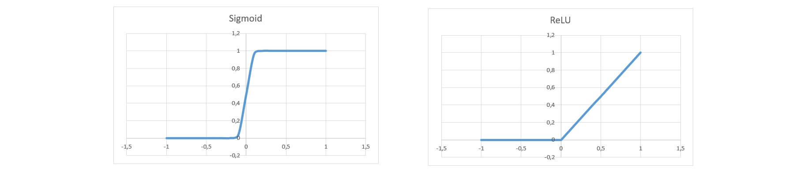
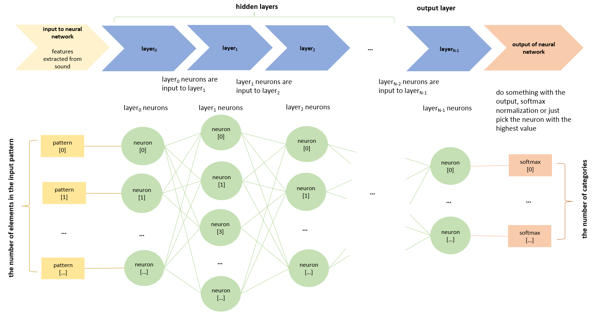
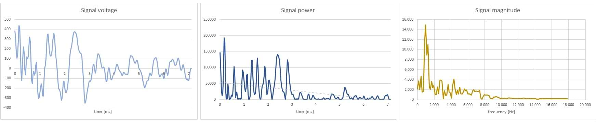

# Clap Recognition Using a Neural Network from Scratch (C++ for Arduino)

Using a neural network for clap recognition might seem like overkill, but it was an exciting challenge to implement. Since this task isn’t overly demanding, Arduino boards can handle it quite well. My goal was to create a system that detects claps and toggles an LED accordingly.


## What You Need

The system is built of the following components:

 - Hardware: An Arduino board (including AVR boards) with an analog microphone and LED.

 - Sound sampling of audio input.

 - Neural network that recognizes claps from other loud sounds.

 - Training sound patterns collected using the same system to improve model accuracy.


## Inspiration and Resources

This library was inspired by a great article [Neural Network from Scratch (C++) by Thakee Nathees](https://medium.com/@thakeenathees/neural-network-from-scratch-c-e2dc8977646b).

For neural network theory, you can check out [Backpropagation calculus](https://www.3blue1brown.com/lessons/backpropagation-calculus).

While developing this library, I focused more on simplicity and code elegance rather than raw performance, meaning there’s still room for optimization.


## Hardware

Clap recognition, including its neural network is not very demanding. An Arduino Mega 2560 will be just fine or an ESP32 for example. Analog microphones are chip but those that accuratelly output analog sound signal are not so easy to find. A LED diode is connected to board's pin through 220 ohm resistor.


## Sound Sampling

A clap lasts around 7 ms. In this time we want to capture 256 samples which gives a sampling rate of 35 kHz. 
It would be better to sample 10 ms with 40 kHz but due to limited processing power 7 ms with 35 kHz will do just fine.

## Neural Network

### The basics

The neuralNetwork.hpp library is designed to use as little memory as possible so it is suitable for Arduino controlers. Besides it doesn't use any heap memory at all making it also suitable for AVR boards.

Let's go briefly through the basics. A neural network is a set of layers, each containing its neurons. The output of one layer is the input to the next. Each input influences each neuron, but not equally. This is why a matrix of weights is used at each layer. Neuron values at layer _L_ are calculated as:


$$
\\ \mathrm{neuron}^{L} = af ( {weight}^{L} \times {input}^{L} + {bias}^{L} )
$$


_Bias_ is a vector of equal size as the output vector of each layer. By providing each neuron with a trainable constant value, bias increases the flexibility of the model, allowing the network to fit the data more accurately.

_af_ is a non-linear neuron activation function. It must be non-linear; otherwise, the whole neural network would just be a linear system. The ones used here are _Sigmoid_ and _ReLU_:


$$
\\ Sigmoid (x) = \frac{1}{1 + e^{-x}}
$$

$$
\\ ReLU (x) = max (0, x)
$$





The size of the input, the weight matrix, the output, and bias vary in each layer.




The output layer neuron values can be expressed as:


$$
\\ \mathrm{neuron}^{Loutput} = af ( {weight}^{Loutput} \times {   af ( {weight}^{Loutput-1} \times {...   input^{Linput}   ...} + {bias}^{Loutput-1} )   }^{Loutput} + {bias}^{Loutput} )
$$


The output of the neural network is an array containing probabilities of categories that the input pattern can belong to. The equation above does not produce the exact probabilities so the neuron values at the output layer need to be further normalized with softmax function for example:


$$
\\ softmax_{[n]} = \frac{e^{neuron_{[n]}}}{\sum_{i=0}^{N^{Loutput}-1} e^{neuron_{[i]}}}  
$$


The correctness of the output depends on how weights and biases are set in all neural network layers. This is where training comes in, which will be addressed later.


## The use of neuralNetwork.hpp library

When calculating the output from the input pattern, the calculation starts at the input layer and proceeds to the output layer. This is why this process is called a forward pass.

```C++
#include "neuralnetwork.hpp"


//                   .--- the number of neurons in the first layer - it corresponds to the size of the patterns that neural network will use to make the categorization
//                   |    .--- second layer activation function
//                   |    |    .--- the number of neurons the second layer 
//                   |    |    |                             .--- output layer activation function
//                   |    |    |                             |      .--- the number of neurons in the output layer - it corresponds to the number of categories that the neural network recognizes
//                   |    |    |                             |      |
neuralNetworkLayer_t<8, ReLU, 16, /* add more if needed */ Sigmoid, 2> neuralNetwork;
// at this point neuralNetwork is initialized with random weights and biases and it is ready for training
// - you can either start training it and export the trained model when fiished
// - or you can load already trained model that is cappable of making usable outputs 

void setup () {
    cinit (); // instead of Serial.begin (115200) or Serial.begin (9600) for AVR boards

    // import trained model from C++ initializer list or int32_t array
    neuralNetwork = {1030875393,1053884929,-1080728422,1065850332, ... ,1056579159};

    // categorize the input pattern
    auto probability = neuralNetwork.forwardPass ( { 18, 20, 7, 2, 1 } ); // forwardPass returns the array which size corresponds to the output layer neurons 
    cout << "probabilities: ( "; // instead of Serial.print
    for (auto p : probability)
        cout << p << " ";
    cout << ")\n";
```

It is difficult to tell the neural network topology (meaning the number of layers, how many neurons each would have and their activation functions) in advance. Just try different arrangements and see which works best for your case.


## The implementation of neural network with C++ variadic template


```C++
// hidden layers
    template <size_t inputCount, size_t af, size_t neuronCount, size_t... sizes> 
    class neuralNetworkLayer_t<inputCount, af, neuronCount, sizes...> {

            // data structures needed for this layer: weight and bias
            float weight [neuronCount][inputCount];
            float bias [neuronCount];

            // include the next layer instance which will include the next layer itself, ...
            neuralNetworkLayer_t<neuronCount, sizes...> nextLayer;

    public:

            // calculates the neurons of this layer and returns the category that the input belongs to
            array<float, outputCount> forwardPass (const float input [inputCount]) {   
                float neuron [neuronCount];

                // z = weight x input + bias
                // neuron = af (z)
                    float z [neuronCount];
                    for (size_t n = 0; n < neuronCount; n++) {
                        z [n] = bias [n];
                        for (size_t i = 0; i < inputCount; i++)
                            z [n] += weight [n][i] * input [i];
                        neuron [n] = af (z [n]);
                    }

                // return what the next layer thinks about the neurons clculated here
                    return nextLayer.forwardPass (neuron);
            }
    };

// output layer
    template <size_t inputCount, size_t af, size_t neuronCount> 
    class neuralNetworkLayer_t<inputCount, af, neuronCount> {

            // data structures needed for this layer: weight and bias
            float weight [neuronCount][inputCount];
            float bias [neuronCount];

        public:
        
            // calculates the output neurons of the neural network and returns the category that the input belongs to
            array<float, neuronCount> forwardPass (const float input [inputCount]) {   
                array<float, neuronCount> neuron {};

                // z = weight x input + bias
                // neuron = af (z)
                    float z [neuronCount];
                    for (size_t n = 0; n < neuronCount; n++) {
                        z [n] = bias [n];
                        for (size_t i = 0; i < inputCount; i++)
                            z [n] += weight [n][i] * input [i];
                        neuron [n] = af (z [n]);
                    }

                // softmax normalization of the result
                    float sum = 0;
                    for (size_t n = 0; n < neuronCount; n++)
                        sum += expf (neuron [n]);
                    for (size_t n = 0; n < neuronCount; n++)
                        if (sum > 0)
                            neuron [n] = expf (neuron [n]) / sum;
                        else
                            neuron [n] = 0;

                // start returning the result through all the previous layers
                    return neuron;
            }
    };
```


## Training the neural network

The following training code is a little oversimplified but works well for demonstration.


```C++
    // This part, including testing different typologies, can be done more efficiently on larger computers and not necessarily on a controller,
    // as Arduino code is portable to standard C++.

    #define epoch 1000 // choose the right number of training iterations so the model gets trained but not overtrained
    for (int _ = 0; _ < epoch; _++) {
        // normally we would need like 1.000 training patterns

                                                            //     .--- tell neuralNetwork that the pattern belongs to category 0 (0 is the index of output vector that designates category 0)
                                                            //     |
        neuralNetwork.backwardPropagation ( { 1, 2, 6, 18, 20 }, { 1, 0, 0 } ); // expected = probability vector telling the neural network that the pattern belongs to category (with index) 0

                                                            //        .--- tell neuralNetwork that the pattern belongs to category 1 (1 is the index of output vector that designates category 1)
                                                            //        |    
        neuralNetwork.backwardPropagation ( { 1, 2, 25, 3, 1 },  { 0, 1, 0 } ); // expected = probability vector telling the neural network that the pattern belongs to category (with index) 1

                                                            //           .--- tell neuralNetwork that the pattern belongs to category 2 (2 is the index of output vector that designates category 2)
                                                            //           |    
        neuralNetwork.backwardPropagation ( { 19, 10, 3, 2, 1 }, { 0, 0, 1 } ); // expected = probability vector telling the neural network that the pattern belongs to category (with index) 2
    }

    // export trained model as C++ int32_t initializer list
    cout << neuralNetwork << endl;
```

Training the neural network involves setting weights and biases using training patterns at the input and expected results at the output. For each given pattern and expected result, an error is assessed at the output layer, and the weights and biases of the output layer are adjusted to minimize the error. Then, the same process is applied to the previous layer, and so on. This is why the process is called backward propagation—it propagates the error at the output layer back to the previous layers.

Training may be too demanding for Arduino boards, but you can do it on bigger machines, export the trained model there and import it to Arduino. This is why _compatibility.h_ library is added, to let Arduino code compile in standard C++ and the other way arround.


### Bacward propagation theory and formulas to update the weights and the biases


Initially, all the weights in all layers of the neural network are initialized with random values. 

Normal Xavier initialization (besides normal Xavier initialization there is also a uniform one that is calculates slightly differently) uses a Gaussian probability distribution with a mean of 0 and a standard deviation of $\sqrt{\frac{2}{I^{L} + N^{L}}}$, where _I<sup>L</sup>_ is the size of the input to layer _L_ and _N<sup>L</sup>_ is the number of neurons in the layer _L_ (size of the output of the layer). 

He initialization uses a Gaussian probability distribution with a mean of 0 and a standard deviation of $\sqrt{\frac{2}{I^{L}}}$, where _I<sup>L</sup>_ is the size of the input to layer _L_.


$$
\\ Xavier = N \left( 0, \sqrt{\frac{2}{I^{L} + N^{L}}} \right)
$$


$$
\\ He = N \left( 0, \sqrt{\frac{2}{I^{L}}} \right)
$$


When the Sigmoid activation function is used, input values are squashed into the range between 0 and 1. This nonlinearity can lead to vanishing gradients, making it difficult for backpropagation to effectively update the network's weights. Xavier initialization addresses this issue by keeping the variance of activations and gradients stable across layers, improving signal flow during training.

In contrast, the ReLU activation function zeroes out all negative inputs, effectively “killing” half of the signal. To compensate for this drop in signal strength, He initialization uses a larger variance than Xavier. This helps maintain the flow of information through the network and ensures more stable training with ReLU-activated layers.


C++ has a built-in pseudo-random generator that produces uniformly distributed random values. The Box-Muller transform can efficiently transform them into Gaussian distributed random numbers. It produces two independent random numbers _N<sub>1</sub>_ and _N<sub>2</sub>_ from two independent uniformly distributed random numbers _U<sub>1</sub>_ and _U<sub>2</sub>_ in the interval (0, 1), but we only need one of them.


$$
\\ N_{1} = \sqrt{-ln (U_{1}))} \cdot cos (2 \cdot \pi \cdot U_{2} ))
$$


The another would be $N_{2} = \sqrt{-ln (U_{1}))} \cdot sin (2 \cdot \pi \cdot U_{2} ))$.


```C++
    // Box-Muller Transform to calculate normaly distributed random variable from uniformly distrubuted random function

    // 1. select 2 independent uniformly distributed random values in interval (0, 1)
    #define MAX_LONG 2147483647
    float U1 = ((float) random (MAX_LONG - 1) + 1) / MAX_LONG;
    float U2 = ((float) random (MAX_LONG - 1) + 1) / MAX_LONG;

    // 2. use Box-Muller transform to tranform them to two independed normally distributed random values with mean of 0 and variance of 1
    float N1 = sqrt (-2 * log (U1)) * cos (2 * M_PI * U2); 
    // float N2 = sqrt (-2 * log (U1)) * sin (2 * M_PI * U2); // we don't actually need the second independent random variable here

    // 3. apply the desired mean of 0 and variance of sqrt (2.0 / inputCount) to random variable N1
    float Xavier = 0 + sqrt (2.0 / (inputCount + neuronCount)) * N1; 
    float He = 0 + sqrt (2.0 / inputCount) * N1; 
```


Biases are usually set to 0.


This part is based on [Backpropagation calculus](https://www.3blue1brown.com/lessons/backpropagation-calculus).


At this point, the results that the neural network produces are, well, pretty random. The neural network must be trained first with a set of patterns belonging to already known categories. The idea of training on each of the known input patterns is to minimize the difference (or the error) between the expected result and the result that the neural network actually produced. To assess the error of a single pattern, we’ll use a variant of the MSE function (mean squared error):


$$
\\ E = \sum_{n=0}^{N^{Loutput}-1} \frac{1}{2} \cdot \left(neuron_{[n]} - expected_{[n]}  \right)^{2}
$$


We could use some other error functions as well but this one differentiates nicely.

What we need to do is calculate the error function gradients $\frac{\partial E}{\partial weight}$ and $\frac{\partial E}{\partial bias}$ and then update the weights and biases in the opposite direction to which the gradient points in all neural network layers.


$$
\\ weight^{L} -= learningRate \cdot \frac{\partial E}{\partial weight^{L}} \ ; \ where \ learningRate \ is \ a \ predefined \ constant, \ say \ 0.01
$$


$$
\\ bias^{L} -= learningRate \cdot \frac{\partial E}{\partial bias^{L}} \ ; \ where \ learningRate \ is \ a \ predefined \ constant, \ say \ 0.01
$$


These are the notations and definitions we are going to use so it will be easier to follow the deduction.


&nbsp;&nbsp;&nbsp;&nbsp;&nbsp;&nbsp; _**L** – we will count the layers of the neural network with L_ <br>
&nbsp;&nbsp;&nbsp;&nbsp;&nbsp;&nbsp; _**Loutput** = 𝑜𝑢𝑡𝑝𝑢𝑡 𝑙𝑎𝑦𝑒𝑟 𝑜𝑓 𝑛𝑒𝑢𝑟𝑎𝑙 𝑛𝑒𝑡𝑤𝑜𝑟𝑘_ <br>
&nbsp;&nbsp;&nbsp;&nbsp;&nbsp;&nbsp; _**n** - we will count the neurons within each layer with n_ <br>
&nbsp;&nbsp;&nbsp;&nbsp;&nbsp;&nbsp; _**N<sup>L</sup>** = the number of neurons at layer L, which is also the number of outputs of layer L_ <br>
&nbsp;&nbsp;&nbsp;&nbsp;&nbsp;&nbsp; _**i** – we will usually count the inputs to each layer with i_ <br>
&nbsp;&nbsp;&nbsp;&nbsp;&nbsp;&nbsp; _**I<sup>L</sup>** = 𝑡ℎ𝑒 𝑛𝑎𝑢𝑚𝑏𝑒𝑟 𝑜𝑓 𝑖𝑛𝑝𝑢𝑡𝑠 𝑡𝑜 𝑡ℎ𝑒 𝑙𝑎𝑦𝑒𝑟 𝐿_ <br>
&nbsp;&nbsp;&nbsp;&nbsp;&nbsp;&nbsp; _**weight<sup>L</sup>** = weight matrix at layer L_ <br>
&nbsp;&nbsp;&nbsp;&nbsp;&nbsp;&nbsp; _**weight <sup>L</sup><sub>[n][i]</sub>** = element [n][i] of weight matrix at layer L_ <br>
&nbsp;&nbsp;&nbsp;&nbsp;&nbsp;&nbsp; _**bias<sup>L</sup>** = bias vector at layer L_ <br>
&nbsp;&nbsp;&nbsp;&nbsp;&nbsp;&nbsp; _**bias<sup>L</sup><sub>[n]</sub>** = element [n] of bias vector at layer L_ <br>
&nbsp;&nbsp;&nbsp;&nbsp;&nbsp;&nbsp; _**z<sup>L</sup>** = intermediate result vector: z<sup>L</sup> = weight<sup>L</sup> x bias<sup>L</sup>_ <br>
&nbsp;&nbsp;&nbsp;&nbsp;&nbsp;&nbsp; _**z<sup>L</sup><sub>[n]</sub>** = element [n] of z vector at layer L_ <br>
&nbsp;&nbsp;&nbsp;&nbsp;&nbsp;&nbsp; _**af** = neuron activation function: af (z)_ <br>
&nbsp;&nbsp;&nbsp;&nbsp;&nbsp;&nbsp; _**af<sup>L</sup><sub>[n]</sub>** = element [n] of calculated neuron value (output) vector at layer L: af (z<sup>L</sup><sub>[n]</sub>)_ <br> 
&nbsp;&nbsp;&nbsp;&nbsp;&nbsp;&nbsp; _**af‘** = neuron activation function derivative_ <br>
&nbsp;&nbsp;&nbsp;&nbsp;&nbsp;&nbsp; _**expected** = vector  of expected values at output layer, since there is only one, we do not have to explicitly label it as e<sup>Loutput</sup>_ <br>
&nbsp;&nbsp;&nbsp;&nbsp;&nbsp;&nbsp; _**expected<sub>[n]</sub>** = element [n] of vector of expected values_ <br>
&nbsp;&nbsp;&nbsp;&nbsp;&nbsp;&nbsp; _**E** = error function calculated on the output of neural network for a single pattern on its input_ <br>
&nbsp;&nbsp;&nbsp;&nbsp;&nbsp;&nbsp; _**delta**_ = $\frac{\partial E}{\partial z}$


#### Gradient $\frac{\partial E}{\partial weight}$ in output layer

Since _E_ is a function of _z_: _E = E (z)_ and _z_ is a function of _weight_: _z = z (weight)_ we can use chain rule for derivatives ( $\frac{\partial f(g(x))}{\partial x}= f'(g(x))⋅g'(x)$  ) to express partial direvaives for each _weight<sub>[n][i]</sub>_. And since _E_ is a function of _af_: _E = E (af)_ and _af_ is a function of _z_: _af = af (z)_ we can use the chain rule again:


&nbsp;&nbsp;&nbsp;&nbsp;&nbsp;&nbsp;&nbsp;&nbsp;&nbsp;&nbsp;[![\\ \frac{\color{Red} \partial E}{\color{Blue} \partial weight_{[n][i]}^{Loutput}} = \frac{\color{Red} \partial E}{\color{DarkGreen}\partial z_{[n]}^{Loutput}} \cdot \frac{\color{DarkGreen}\partial z_{[n]}^{Loutput}}{\color{Blue} \partial weight_{[n][i]}^{Loutput}} = \frac{\color{Red} \partial E}{\partial af_{[n]}^{Loutput}} \cdot \frac{\partial af_{[n]}^{Loutput}}{\color{DarkGreen}\partial z_{[n]}^{Loutput}} \cdot \frac{\color{DarkGreen}\partial z_{[n]}^{Loutput}}{\color{Blue} \partial weight_{[n][i]}^{Loutput}}](https://latex.codecogs.com/svg.latex?%5C%5C%20%5Cfrac%7B%5Ccolor%7BRed%7D%20%5Cpartial%20E%7D%7B%5Ccolor%7BBlue%7D%20%5Cpartial%20weight_%7B%5Bn%5D%5Bi%5D%7D%5E%7BLoutput%7D%7D%20%3D%20%5Cfrac%7B%5Ccolor%7BRed%7D%20%5Cpartial%20E%7D%7B%5Ccolor%7BDarkGreen%7D%5Cpartial%20z_%7B%5Bn%5D%7D%5E%7BLoutput%7D%7D%20%5Ccdot%20%5Cfrac%7B%5Ccolor%7BDarkGreen%7D%5Cpartial%20z_%7B%5Bn%5D%7D%5E%7BLoutput%7D%7D%7B%5Ccolor%7BBlue%7D%20%5Cpartial%20weight_%7B%5Bn%5D%5Bi%5D%7D%5E%7BLoutput%7D%7D%20%3D%20%5Cfrac%7B%5Ccolor%7BRed%7D%20%5Cpartial%20E%7D%7B%5Cpartial%20af_%7B%5Bn%5D%7D%5E%7BLoutput%7D%7D%20%5Ccdot%20%5Cfrac%7B%5Cpartial%20af_%7B%5Bn%5D%7D%5E%7BLoutput%7D%7D%7B%5Ccolor%7BDarkGreen%7D%5Cpartial%20z_%7B%5Bn%5D%7D%5E%7BLoutput%7D%7D%20%5Ccdot%20%5Cfrac%7B%5Ccolor%7BDarkGreen%7D%5Cpartial%20z_%7B%5Bn%5D%7D%5E%7BLoutput%7D%7D%7B%5Ccolor%7BBlue%7D%20%5Cpartial%20weight_%7B%5Bn%5D%5Bi%5D%7D%5E%7BLoutput%7D%7D)](#_)


 - Let's solve this expression part by part. In the first part all the derivateives of $\sum_{k=0}^{N^{Loutput}-1} \frac{1}{2} \cdot \left(af_{[k]}^{Loutput} - expected_{[k]} \right)^{2}$ terms are 0 except when _k_ = _n_:


&nbsp;&nbsp;&nbsp;&nbsp;&nbsp;&nbsp;&nbsp;&nbsp;&nbsp;&nbsp;[![\\ \frac{\color{Red} \partial E}{\partial af_{[n]}^{Loutput}} = \frac{\color{Red} \partial  \sum_{k=0}^{N^{Loutput}-1} \frac{1}{2} \cdot \left(af_{[k]}^{Loutput} - expected_{[k]} \right)^{2}}{\partial af_{[n]}^{Loutput}} = \left(af_{[n]}^{Loutput} - expected_{[n]} \right)](https://latex.codecogs.com/svg.latex?%5C%5C%20%5Cfrac%7B%5Ccolor%7BRed%7D%20%5Cpartial%20E%7D%7B%5Cpartial%20af_%7B%5Bn%5D%7D%5E%7BLoutput%7D%7D%20%3D%20%5Cfrac%7B%5Ccolor%7BRed%7D%20%5Cpartial%20%20%5Csum_%7Bk%3D0%7D%5E%7BN%5E%7BLoutput%7D-1%7D%20%5Cfrac%7B1%7D%7B2%7D%20%5Ccdot%20%5Cleft(af_%7B%5Bk%5D%7D%5E%7BLoutput%7D%20-%20expected_%7B%5Bk%5D%7D%20%5Cright)%5E%7B2%7D%7D%7B%5Cpartial%20af_%7B%5Bn%5D%7D%5E%7BLoutput%7D%7D%20%3D%20%5Cleft(af_%7B%5Bn%5D%7D%5E%7BLoutput%7D%20-%20expected_%7B%5Bn%5D%7D%20%5Cright))](#_)


 - The second part is af' by definition.


&nbsp;&nbsp;&nbsp;&nbsp;&nbsp;&nbsp;&nbsp;&nbsp;&nbsp;&nbsp;[![\\ \frac{\partial af_{[n]}^{Loutput}}{\color{DarkGreen}\partial z_{[n]}^{Loutput}} = \frac{\partial af \left( \color{DarkGreen}\partial z_{[n]}^{Loutput} \color{Black} \right)}{\color{DarkGreen}\partial z_{[n]}^{Loutput}} = {af'}\left(z_{[n]}^{Loutput}\right)](https://latex.codecogs.com/svg.latex?%5C%5C%20%5Cfrac%7B%5Cpartial%20af_%7B%5Bn%5D%7D%5E%7BLoutput%7D%7D%7B%5Ccolor%7BDarkGreen%7D%5Cpartial%20z_%7B%5Bn%5D%7D%5E%7BLoutput%7D%7D%20%3D%20%5Cfrac%7B%5Cpartial%20af%20%5Cleft(%20%5Ccolor%7BDarkGreen%7D%5Cpartial%20z_%7B%5Bn%5D%7D%5E%7BLoutput%7D%20%5Ccolor%7BBlack%7D%20%5Cright)%7D%7B%5Ccolor%7BDarkGreen%7D%5Cpartial%20z_%7B%5Bn%5D%7D%5E%7BLoutput%7D%7D%20%3D%20%7Baf'%7D%5Cleft(z_%7B%5Bn%5D%7D%5E%7BLoutput%7D%5Cright))](#_)


- In the third part all the derivateives of $\sum_{k=0}^{I^{Loutput}-1} \left( {weight_{[n][i]}^{Loutput}}  \cdot af_{[k]}^{Loutput-1} \right) + bias_{[n]}^{Loutput}$ terms are 0 except when _k_ = _i_:


&nbsp;&nbsp;&nbsp;&nbsp;&nbsp;&nbsp;&nbsp;&nbsp;&nbsp;&nbsp;[![\\ \frac{\color{DarkGreen}\partial z_{[n]}^{Loutput}}{\color{Blue} \partial weight_{[n][i]}^{Loutput}} = \frac{\color{DarkGreen}\partial \sum_{k=0}^{I^{Loutput}-1} \left( {weight_{[n][i]}^{Loutput}}  \cdot af_{[k]}^{Loutput-1} \right) + bias_{[n]}^{Loutput}} {\color{Blue} \partial weight_{[n][i]}^{Loutput}} = af_{[i]}^{Loutput-1}](https://latex.codecogs.com/svg.latex?%5C%5C%20%5Cfrac%7B%5Ccolor%7BDarkGreen%7D%5Cpartial%20z_%7B%5Bn%5D%7D%5E%7BLoutput%7D%7D%7B%5Ccolor%7BBlue%7D%20%5Cpartial%20weight_%7B%5Bn%5D%5Bi%5D%7D%5E%7BLoutput%7D%7D%20%3D%20%5Cfrac%7B%5Ccolor%7BDarkGreen%7D%5Cpartial%20%5Csum_%7Bk%3D0%7D%5E%7BI%5E%7BLoutput%7D-1%7D%20%5Cleft(%20%7Bweight_%7B%5Bn%5D%5Bi%5D%7D%5E%7BLoutput%7D%7D%20%20%5Ccdot%20af_%7B%5Bk%5D%7D%5E%7BLoutput-1%7D%20%5Cright)%20%2B%20bias_%7B%5Bn%5D%7D%5E%7BLoutput%7D%7D%20%7B%5Ccolor%7BBlue%7D%20%5Cpartial%20weight_%7B%5Bn%5D%5Bi%5D%7D%5E%7BLoutput%7D%7D%20%3D%20af_%7B%5Bi%5D%7D%5E%7BLoutput-1%7D)](#_)


> [!NOTE]
> Let us at this point define _delta_ as $\frac{\partial E}{\partial z}$. _Delta_ has and important role in backward propagation. With its help we, as we will se:<br>
> - update weights<br>
> - update biases<br>
> - propagate error to the previous layers
>


Considering the terms that we have just solved above we get:


&nbsp;&nbsp;&nbsp;&nbsp;&nbsp;&nbsp;&nbsp;&nbsp;&nbsp;&nbsp;[![\\ {delta_{[n]}^{Loutput}} = \frac{\color{Red} \partial E}{\color{DarkGreen} \partial z_{[n]}^{Loutput}} = \frac{\color{Red} \partial E}{\partial af_{[n]}^{Loutput}} \cdot \frac{\partial af_{[n]}^{Loutput}}{\color{DarkGreen} \partial z_{[n]}^{Loutput}} = \left( af_{[n]}^{Loutput} - expected_{[n]} \right) \cdot {af'}_{[n]}^{Loutput}](https://latex.codecogs.com/svg.latex?%5C%5C%20%7Bdelta_%7B%5Bn%5D%7D%5E%7BLoutput%7D%7D%20%3D%20%5Cfrac%7B%5Ccolor%7BRed%7D%20%5Cpartial%20E%7D%7B%5Ccolor%7BDarkGreen%7D%20%5Cpartial%20z_%7B%5Bn%5D%7D%5E%7BLoutput%7D%7D%20%3D%20%5Cfrac%7B%5Ccolor%7BRed%7D%20%5Cpartial%20E%7D%7B%5Cpartial%20af_%7B%5Bn%5D%7D%5E%7BLoutput%7D%7D%20%5Ccdot%20%5Cfrac%7B%5Cpartial%20af_%7B%5Bn%5D%7D%5E%7BLoutput%7D%7D%7B%5Ccolor%7BDarkGreen%7D%20%5Cpartial%20z_%7B%5Bn%5D%7D%5E%7BLoutput%7D%7D%20%3D%20%5Cleft(%20af_%7B%5Bn%5D%7D%5E%7BLoutput%7D%20-%20expected_%7B%5Bn%5D%7D%20%5Cright)%20%5Ccdot%20%7Baf'%7D_%7B%5Bn%5D%7D%5E%7BLoutput%7D)](#_)


And finally:


&nbsp;&nbsp;&nbsp;&nbsp;&nbsp;&nbsp;&nbsp;&nbsp;&nbsp;&nbsp;[![\\ \frac{\color{Red} \partial E}{\color{Blue} \partial weight_{[n][i]}^{Loutput}} =  {delta_{[n]}^{Loutput}} \cdot af_{[i]}^{Loutput-1}](https://latex.codecogs.com/svg.latex?%5C%5C%20%5Cfrac%7B%5Ccolor%7BRed%7D%20%5Cpartial%20E%7D%7B%5Ccolor%7BBlue%7D%20%5Cpartial%20weight_%7B%5Bn%5D%5Bi%5D%7D%5E%7BLoutput%7D%7D%20%3D%20%20%7Bdelta_%7B%5Bn%5D%7D%5E%7BLoutput%7D%7D%20%5Ccdot%20af_%7B%5Bi%5D%7D%5E%7BLoutput-1%7D)](#_)


#### Gradient $\frac{\partial E}{\partial bias}$ in output layer

Similary we can calculate $\frac{\partial E}{\partial bias^{Loutput}}$. _E_ is a function of _z_: _E = E (z)_ and _z_ is a function of _bias_ so we use the chain rule again:


&nbsp;&nbsp;&nbsp;&nbsp;&nbsp;&nbsp;&nbsp;&nbsp;&nbsp;&nbsp;[![\\ \frac{\color{Red} \partial E}{\color{Purple} \partial bias_{[n]}^{Loutput}} = \frac{\color{Red} \partial E}{\color{DarkGreen}\partial z_{[n]}^{Loutput}} \cdot \frac{\color{DarkGreen}\partial z_{[n]}^{Loutput}}{\color{Purple} \partial bias_{[n]}^{Loutput}} = delta_{n}^{Loutput} \cdot \frac{\color{DarkGreen}\partial \sum_{k=0}^{I^{Loutput}-1} \left( {weight_{[n][k]}^{Loutput}}  \cdot af_{[k]}^{Loutput-1} \right) +  bias_{[n]}^{Loutput}}{\color{Purple} \partial bias_{[n]}^{Loutput}} = delta_{n}^{Loutput} \cdot 1](https://latex.codecogs.com/svg.latex?%5C%5C%20%5Cfrac%7B%5Ccolor%7BRed%7D%20%5Cpartial%20E%7D%7B%5Ccolor%7BPurple%7D%20%5Cpartial%20bias_%7B%5Bn%5D%7D%5E%7BLoutput%7D%7D%20%3D%20%5Cfrac%7B%5Ccolor%7BRed%7D%20%5Cpartial%20E%7D%7B%5Ccolor%7BDarkGreen%7D%5Cpartial%20z_%7B%5Bn%5D%7D%5E%7BLoutput%7D%7D%20%5Ccdot%20%5Cfrac%7B%5Ccolor%7BDarkGreen%7D%5Cpartial%20z_%7B%5Bn%5D%7D%5E%7BLoutput%7D%7D%7B%5Ccolor%7BPurple%7D%20%5Cpartial%20bias_%7B%5Bn%5D%7D%5E%7BLoutput%7D%7D%20%3D%20delta_%7Bn%7D%5E%7BLoutput%7D%20%5Ccdot%20%5Cfrac%7B%5Ccolor%7BDarkGreen%7D%5Cpartial%20%5Csum_%7Bk%3D0%7D%5E%7BI%5E%7BLoutput%7D-1%7D%20%5Cleft(%20%7Bweight_%7B%5Bn%5D%5Bk%5D%7D%5E%7BLoutput%7D%7D%20%20%5Ccdot%20af_%7B%5Bk%5D%7D%5E%7BLoutput-1%7D%20%5Cright)%20%2B%20%20bias_%7B%5Bn%5D%7D%5E%7BLoutput%7D%7D%7B%5Ccolor%7BPurple%7D%20%5Cpartial%20bias_%7B%5Bn%5D%7D%5E%7BLoutput%7D%7D%20%3D%20delta_%7Bn%7D%5E%7BLoutput%7D%20%5Ccdot%201)](#_)


> [!IMPORTANT]
> #### Weight and bias update formulas for output layer
>
> Considering that the neurons at the output layer are already calculated when the error occurs we can calculate _**delta<sup>Loutput<sup>**_:
>
>
> $$
> \\ {delta_{[n]}^{Loutput}} = \left( neuron_{[n]}^{Loutput} - expected_{[n]} \right) \cdot {af'} \left( neuron_{[n]}^{Loutput} \right) \ ; \ n \ ∈\ [0, N^{Loutput}) 
> $$
>
>
> Considering that $\frac{\partial E}{\partial weight_{[n][i]}^{Loutput}} = delta_{[n]}^{Loutput}⋅af_{[n]}^{Loutput}$ and $af_{[n]}^{Loutput-1}=input_{[n]}^{Loutput}$ we can update _**weight<sup>Loutput</sup>**_:
> 
>
> $$
> \\ weight_{[n][i]}^{Loutput} -= learningRate \cdot {delta_{[n]}^{Loutput}} \cdot input_{[i]}^{Loutput} \ ; \ learningRate \ is \ tipically \ 0.01 \ ; \ n \ ∈\ [0, N^{Loutput}) \ ; \ i \ ∈ \ [0, I^{Loutput})
> $$
>
>
> Similary we can update _**bias<sup>Loutput</sup>**_:
>
>
> $$
> \\ bias_{[n]}^{Loutput} -= learningRate \cdot {delta_{[n]}^{Loutput}} \ ; \ learningRate \ is \ tipically \ 0.01 \ ; \ n \ ∈\ [0, N^{Loutput})
> $$
>


#### Gradient $\frac{\partial E}{\partial weight}$ in hidden layers

Similarly as we did with the output layer we can go one layer back:

&nbsp;&nbsp;&nbsp;&nbsp;&nbsp;&nbsp;&nbsp;&nbsp;&nbsp;&nbsp;[![\\ \frac{\color{Red} \partial E}{\color{Blue} \partial weight_{[i][j]}^{Loutput-1}} = \frac{\color{Red} \partial E}{\color{DarkGreen}\partial z_{[i]}^{Loutput-1}} \cdot \frac{\color{DarkGreen}\partial z_{[i]}^{Loutput-1}}{\color{Blue} \partial weight_{[i][j]}^{Loutput-1}} = delta_{[i]}^{Loutput-1} \cdot \frac{\color{DarkGreen}\partial z_{[i]}^{Loutput-1}}{\color{Blue} \partial weight_{[i][j]}^{Loutput-1}} = \frac{\color{Red} \partial E}{\partial af_{[i]}^{Loutput-1}} \cdot \frac{\partial af_{[i]}^{Loutput-1}}{\color{DarkGreen}\partial z_{[i]}^{Loutput-1}} \cdot \frac{\color{DarkGreen}\partial z_{[i]}^{Loutput-1}}{\color{Blue} \partial weight_{[i][j]}^{Loutput-1}}](https://latex.codecogs.com/svg.latex?%5C%5C%20%5Cfrac%7B%5Ccolor%7BRed%7D%20%5Cpartial%20E%7D%7B%5Ccolor%7BBlue%7D%20%5Cpartial%20weight_%7B%5Bi%5D%5Bj%5D%7D%5E%7BLoutput-1%7D%7D%20%3D%20%5Cfrac%7B%5Ccolor%7BRed%7D%20%5Cpartial%20E%7D%7B%5Ccolor%7BDarkGreen%7D%5Cpartial%20z_%7B%5Bi%5D%7D%5E%7BLoutput-1%7D%7D%20%5Ccdot%20%5Cfrac%7B%5Ccolor%7BDarkGreen%7D%5Cpartial%20z_%7B%5Bi%5D%7D%5E%7BLoutput-1%7D%7D%7B%5Ccolor%7BBlue%7D%20%5Cpartial%20weight_%7B%5Bi%5D%5Bj%5D%7D%5E%7BLoutput-1%7D%7D%20%3D%20delta_%7B%5Bi%5D%7D%5E%7BLoutput-1%7D%20%5Ccdot%20%5Cfrac%7B%5Ccolor%7BDarkGreen%7D%5Cpartial%20z_%7B%5Bi%5D%7D%5E%7BLoutput-1%7D%7D%7B%5Ccolor%7BBlue%7D%20%5Cpartial%20weight_%7B%5Bi%5D%5Bj%5D%7D%5E%7BLoutput-1%7D%7D%20%3D%20%5Cfrac%7B%5Ccolor%7BRed%7D%20%5Cpartial%20E%7D%7B%5Cpartial%20af_%7B%5Bi%5D%7D%5E%7BLoutput-1%7D%7D%20%5Ccdot%20%5Cfrac%7B%5Cpartial%20af_%7B%5Bi%5D%7D%5E%7BLoutput-1%7D%7D%7B%5Ccolor%7BDarkGreen%7D%5Cpartial%20z_%7B%5Bi%5D%7D%5E%7BLoutput-1%7D%7D%20%5Ccdot%20%5Cfrac%7B%5Ccolor%7BDarkGreen%7D%5Cpartial%20z_%7B%5Bi%5D%7D%5E%7BLoutput-1%7D%7D%7B%5Ccolor%7BBlue%7D%20%5Cpartial%20weight_%7B%5Bi%5D%5Bj%5D%7D%5E%7BLoutput-1%7D%7D)](#_)


While we can use the same deduction as we did for outptul layer for the second part, which is _af'<sub>[i]</sub><sup>Loutput-1</sup>_ and the third part, which is _af<sub>[j]</sub><sup>Loutput-2</sup>_ we can not do the same for the first part  $\frac{\partial E}{\partial af_{[i]}^{Loutput-1}}$. Because this previous-layer neuron _[i]_ influences the error along multiple different paths, the derivative of the error with respect to this neuron, the sensitivity of _E_ to changes in _af<sub>[i]</sub><sup>Loutput-1</sup>_, involves adding up multiple different chain rule expressions corresponding to each path of influence (chain rule for multivariable functions: $\frac{\partial f \left( g \left( x \right) , h \left( x \right) \right)}{\partial x} = \frac{\partial f}{\partial g \left( x \right)} \cdot \frac{\partial g \left( x \right)}{\partial x} + \frac{\partial f}{\partial h \left( x \right)} \cdot \frac{\partial h \left( x \right)}{\partial x}$ ). 


&nbsp;&nbsp;&nbsp;&nbsp;&nbsp;&nbsp;&nbsp;&nbsp;&nbsp;&nbsp;[![\\ \frac{\color{Red} \partial E}{\partial af_{[i]}^{Loutput-1}} = \sum_{n=0}^{N^{Loutput}-1} \frac{\color{Red} \partial E}{\partial af_{[n]}^{Loutput}} \cdot \frac{\partial af_{[n]}^{Loutput}}{\color{DarkGreen} \partial z_{[n]}^{Loutput}} \cdot \frac{\color{DarkGreen} \partial z_{[n]}^{Loutput}}{\partial af_{[i]}^{Loutput-1}}](https://latex.codecogs.com/svg.latex?%5C%5C%20%5Cfrac%7B%5Ccolor%7BRed%7D%20%5Cpartial%20E%7D%7B%5Cpartial%20af_%7B%5Bi%5D%7D%5E%7BLoutput-1%7D%7D%20%3D%20%5Csum_%7Bn%3D0%7D%5E%7BN%5E%7BLoutput%7D-1%7D%20%5Cfrac%7B%5Ccolor%7BRed%7D%20%5Cpartial%20E%7D%7B%5Cpartial%20af_%7B%5Bn%5D%7D%5E%7BLoutput%7D%7D%20%5Ccdot%20%5Cfrac%7B%5Cpartial%20af_%7B%5Bn%5D%7D%5E%7BLoutput%7D%7D%7B%5Ccolor%7BDarkGreen%7D%20%5Cpartial%20z_%7B%5Bn%5D%7D%5E%7BLoutput%7D%7D%20%5Ccdot%20%5Cfrac%7B%5Ccolor%7BDarkGreen%7D%20%5Cpartial%20z_%7B%5Bn%5D%7D%5E%7BLoutput%7D%7D%7B%5Cpartial%20af_%7B%5Bi%5D%7D%5E%7BLoutput-1%7D%7D)](#_)


As we have already derived for output layer, the first two parts under _E_ are _delta<sub>[n]</sub><sup>Loutput</sup>_. The third part is _weight<sub>[n][i]</sub><sup>Loutput</sup>_ since all the derivateives of $\sum_{k=0}^{I^{Loutput}-1} \left( {weight_{[n][i]}^{Loutput}}  \cdot af_{[k]}^{Loutput-1} \right) + bias_{[n]}^{Loutput}$ terms are 0 except when _k_ = _i_:


&nbsp;&nbsp;&nbsp;&nbsp;&nbsp;&nbsp;&nbsp;&nbsp;&nbsp;&nbsp;[![\\ \frac{\color{DarkGreen} \partial z_{[n]}^{Loutput}}{\partial af_{[i]}^{Loutput-1}} = \frac{\color{DarkGreen}\partial \sum_{k=0}^{N^{Loutput}-1} \left( {weight_{[n][k]}^{Loutput}}  \cdot af_{[k]}^{Loutput-1} \right) + bias_{[n]}^{Loutput}}{\partial af_{[i]}^{Loutput-1}} = weight_{[n][i]}^{Loutput}](https://latex.codecogs.com/svg.latex?%5C%5C%20%5Cfrac%7B%5Ccolor%7BDarkGreen%7D%20%5Cpartial%20z_%7B%5Bn%5D%7D%5E%7BLoutput%7D%7D%7B%5Cpartial%20af_%7B%5Bi%5D%7D%5E%7BLoutput-1%7D%7D%20%3D%20%5Cfrac%7B%5Ccolor%7BDarkGreen%7D%5Cpartial%20%5Csum_%7Bk%3D0%7D%5E%7BN%5E%7BLoutput%7D-1%7D%20%5Cleft(%20%7Bweight_%7B%5Bn%5D%5Bk%5D%7D%5E%7BLoutput%7D%7D%20%20%5Ccdot%20af_%7B%5Bk%5D%7D%5E%7BLoutput-1%7D%20%5Cright)%20%2B%20bias_%7B%5Bn%5D%7D%5E%7BLoutput%7D%7D%7B%5Cpartial%20af_%7B%5Bi%5D%7D%5E%7BLoutput-1%7D%7D%20%3D%20weight_%7B%5Bn%5D%5Bi%5D%7D%5E%7BLoutput%7D)](#_)


So finally:

 
&nbsp;&nbsp;&nbsp;&nbsp;&nbsp;&nbsp;&nbsp;&nbsp;&nbsp;&nbsp;[![\\ \frac{\color{Red} \partial E}{\color{Blue} \partial weight_{[i][j]}^{Loutput-1}} = \sum_{n=0}^{N^{Loutput}-1} \left( delta_{[n]}^{Loutput} \cdot weight_{[n][i]}^{Loutput} \right) \cdot  {af'}_{[i]}^{Loutput-1} \cdot af_{[j]}^{Loutput-2} = delta_{[i]}^{Loutput-1}  \cdot af_{[j]}^{Loutput-2}](https://latex.codecogs.com/svg.latex?%5C%5C%20%5Cfrac%7B%5Ccolor%7BRed%7D%20%5Cpartial%20E%7D%7B%5Ccolor%7BBlue%7D%20%5Cpartial%20weight_%7B%5Bi%5D%5Bj%5D%7D%5E%7BLoutput-1%7D%7D%20%3D%20%5Csum_%7Bn%3D0%7D%5E%7BN%5E%7BLoutput%7D-1%7D%20%5Cleft(%20delta_%7B%5Bn%5D%7D%5E%7BLoutput%7D%20%5Ccdot%20weight_%7B%5Bn%5D%5Bi%5D%7D%5E%7BLoutput%7D%20%5Cright)%20%5Ccdot%20%20%7Baf'%7D_%7B%5Bi%5D%7D%5E%7BLoutput-1%7D%20%5Ccdot%20af_%7B%5Bj%5D%7D%5E%7BLoutput-2%7D%20%3D%20delta_%7B%5Bi%5D%7D%5E%7BLoutput-1%7D%20%20%5Ccdot%20af_%7B%5Bj%5D%7D%5E%7BLoutput-2%7D)](#_)


> [!NOTE]
> This equation gives us a usefull connection between _delta<sup>Loutput</sup>_ and _delta<sup>Loutput-1</sup>_. By going to even lower layers it would just mean repeating the same steps again at each layer:
>
>  
> &nbsp;&nbsp;&nbsp;&nbsp;&nbsp;&nbsp;&nbsp;&nbsp;&nbsp;&nbsp;[![\\ delta_{[k]}^{L} =  ... \sum_{i=0}^{N^{Loutput-1}-1} \left( \sum_{n=0}^{N^{Loutput}-1} \left( delta_{[n]}^{Loutput} \cdot weight_{[n][i]}^{Loutput} \right) \cdot  {af'}_{[i]}^{Loutput-1} \cdot weight_{[i][j]}^{Loutput-1} \right) \cdot {af'}_{[j]}^{Loutput-2} ...](https://latex.codecogs.com/svg.latex?%5C%5C%20delta_%7B%5Bk%5D%7D%5E%7BL%7D%20%3D%20%20...%20%5Csum_%7Bi%3D0%7D%5E%7BN%5E%7BLoutput-1%7D-1%7D%20%5Cleft(%20%5Csum_%7Bn%3D0%7D%5E%7BN%5E%7BLoutput%7D-1%7D%20%5Cleft(%20delta_%7B%5Bn%5D%7D%5E%7BLoutput%7D%20%5Ccdot%20weight_%7B%5Bn%5D%5Bi%5D%7D%5E%7BLoutput%7D%20%5Cright)%20%5Ccdot%20%20%7Baf'%7D_%7B%5Bi%5D%7D%5E%7BLoutput-1%7D%20%5Ccdot%20weight_%7B%5Bi%5D%5Bj%5D%7D%5E%7BLoutput-1%7D%20%5Cright)%20%5Ccdot%20%7Baf'%7D_%7B%5Bj%5D%7D%5E%7BLoutput-2%7D%20...)](#_)
>
> 
>  so we can write a recursive equation for all hidden layers:
>
>
> $$
> \\ delta_{[i]}^{L-1} = \sum_{n=0}^{N^{L}-1} \left( delta_{[n]}^{L} \cdot weight_{[n][i]}^{L} \right) \cdot {af'}_{[i]}^{L-1} 
> $$
>


#### Gradient $\frac{\partial E}{\partial bias}$ in previous (hidden) layers

Similary we can calculate $\frac{\partial E}{\partial bias^{L}}$. We use the same logic as for output layer:


&nbsp;&nbsp;&nbsp;&nbsp;&nbsp;&nbsp;&nbsp;&nbsp;&nbsp;&nbsp;[![\\ \frac{\color{Red} \partial E}{\color{Purple} \partial bias_{[i]}^{L}} = \frac{\color{Red} \partial E}{\color{DarkGreen}\partial z_{[i]}^{L}} \cdot \frac{\color{DarkGreen}\partial z_{[i]}^{L}}{\color{Purple} \partial bias_{[i]}^{L}} = delta_{i}^{L} \cdot 1](https://latex.codecogs.com/svg.latex?%5C%5C%20%5Cfrac%7B%5Ccolor%7BRed%7D%20%5Cpartial%20E%7D%7B%5Ccolor%7BPurple%7D%20%5Cpartial%20bias_%7B%5Bi%5D%7D%5E%7BL%7D%7D%20%3D%20%5Cfrac%7B%5Ccolor%7BRed%7D%20%5Cpartial%20E%7D%7B%5Ccolor%7BDarkGreen%7D%5Cpartial%20z_%7B%5Bi%5D%7D%5E%7BL%7D%7D%20%5Ccdot%20%5Cfrac%7B%5Ccolor%7BDarkGreen%7D%5Cpartial%20z_%7B%5Bi%5D%7D%5E%7BL%7D%7D%7B%5Ccolor%7BPurple%7D%20%5Cpartial%20bias_%7B%5Bi%5D%7D%5E%7BL%7D%7D%20%3D%20delta_%7Bi%7D%5E%7BL%7D%20%5Ccdot%201)](#_)


> [!IMPORTANT]
> #### Weight and bias update formulas for previous (hidden) layer
>
>
> Let's shift _L_ by 1 in recursive equation for hidden layers _**delta<sup>L<sup>**_ for practical reasons:
>
>
> $$
> \\ delta_{[i]}^{L} = \sum_{n=0}^{N^{L+1}-1} \left( delta_{[n]}^{L+1} \cdot weight_{[n][i]}^{L+1} \right) \cdot {af'}_{[i]}^{L} \ ; \ i \ ∈ \ [0, N^{L}) 
> $$
>
> Updating _**weight<sup>L</sup>**_ is the same as for output layer:
> 
>
> $$
> \\ weight_{[i][j]}^{L} -= learningRate \cdot {delta_{[i]}^{L}} \cdot input_{[j]}^{L} \ ; \ learningRate \ is \ tipically \ 0.01 \ ; \ i \ ∈\ [0, N^{L}) \ ; \ j \ ∈ \ [0, I^{L})
> $$
>
> 
> Updating _**bias<sup>L</sup>**_ is the same as for output layer:
>
>
> $$
> \\ bias_{[i]}^{L} -= learningRate \cdot {delta_{[i]}^{L}} \ ; \ learningRate \ is \ tipically \ 0.01 \ ; \ i \ ∈\ [0, N^{L})
> $$
>

## Implementation of backward propagation with C++ variadic template

Please note that delta gets updated in two distinct layers: _L_ and _L+1_. Neural network here is implemented as C++ variadic template so one layer can not directly access another's internal data. This is why delta gets updated in two parts. In layer L+1 weight<sup>L+1</sup> x delta<sup>L+1</sup> gets calculated. Once the procssing is returned to layer _L_ it is multiplied by _af'(z<sup>L</sup>_).


```C++
// hidden layers
    template<typename input_t, typename expected_t>
    void backwardPropagation (const input_t (&input) [inputCount], const expected_t (&expected) [outputCount], float previousLayerDelta [inputCount] = NULL) { // the size of expected in all layers equals the size of the output of the output layer

        private:

            // data structures needed for this layer: weight and bias
            float weight [neuronCount][inputCount];
            float bias [neuronCount];

            // include the next layer instance which will include the next layer itself, ...
            neuralNetworkLayer_t<neuronCount, sizes...> nextLayer;

        public:

            // iterate from the last layer to the first and update weight and bias meanwhile
            template<typename input_t, typename expected_t>
            float backwardPropagation (const input_t (&input) [inputCount], const expected_t (&expected) [outputCount], float previousLayerDelta [inputCount] = NULL) { // the size of expected in all layers equals the size of the output of the output layer

                // while moving forward do exactly the same as forwardPass function does
                    float z [neuronCount];
                    float neuron [neuronCount];

                    // z = weight x input + bias
                    // neuron = af (z)
                    for (size_t n = 0; n < neuronCount; n++) {
                        z [n] = bias [n];
                        for (size_t i = 0; i < inputCount; i++)
                            z [n] += weight [n][i] * input [i];
                        neuron [n] = af (z [n]);
                    }

                // calculate the first part of delta in the next layer then apply activation function derivative here
                    // delta = next layer weight * next layer delta * af' (z)
                    float delta [neuronCount];
                    float error = nextLayer.__backwardPropagation__ (neuron, expected, delta);
                    // calculate only the second part of delta, the first par has already been calculated at the next layer
                    for (size_t n = 0; n < neuronCount; n++)
                        delta [n] *= afDerivative (z [n]);

                // update weight and bias at this layer
                    for (size_t n = 0; n < neuronCount; n++) {

                        // update weight
                        for (size_t i = 0; i < inputCount; i++)
                            weight [n][i] -= learningRate * delta [n] * input [i];

                        // update bias
                        bias [n] -= learningRate * delta [n];
                    }

                // calculate only the first part of previous layer delta, since z from previous layer is not available here
                    // previousLayerDelta = weight * delta * af' (previous layer z)
                    for (size_t i = 0; i < inputCount; i++) {
                        previousLayerDelta [i] = 0;
                        for (size_t n = 0; n < neuronCount; n++)
                            previousLayerDelta [i] += weight [n][i] * delta [n];
                    }

                    return error;
            }
    };

// output layer
    template<typename input_t, typename expected_t>
    void backwardPropagation (const input_t (&input) [inputCount], const expected_t (&expected) [neuronCount], float previousLayerDelta [inputCount] = NULL) { // the size of expected in all layers equals the size of the output of the output layer

        private:

            // data structures needed for this layer: weight and bias
            float weight [neuronCount][inputCount];
            float bias [neuronCount];

        public:
        
            // iterate from the last layer to the first and adjust weight and bias meanwhile, returns the error clculated at output layer
            template<typename input_t, typename expected_t>
            float backwardPropagation (const input_t (&input) [inputCount], const expected_t (&expected) [neuronCount], float previousLayerDelta [inputCount] = NULL) { // the size of expected in all layers equals the size of the output of the output layer

                // while moving forward do exactly the same as forwardPass function does
                    float z [neuronCount];
                    float neuron [neuronCount];

                    // z = weight x input + bias
                    // neuron = af (z)
                    for (size_t n = 0; n < neuronCount; n++) {
                        z [n] = bias [n];
                        for (size_t i = 0; i < inputCount; i++)
                            z [n] += weight [n][i] * input [i];
                        neuron [n] = af (z [n]);
                    }

                // calculate the error
                    float error = 0;
                    for (size_t n = 0; n < neuronCount; n++)
                        error += (expected [n] - neuron [n]) * (expected [n] - neuron [n]);
                    error = sqrt (error) / 2;

                // update weight and bias at output layer
                    // delta = (neuron - expected) * af' (z)
                    // weight -= learningRate * delta * input
                    // bias -= learningRate * delta

                    float delta [neuronCount]; 
                    for (size_t n = 0; n < neuronCount; n++) {
                        // calculat delta at output layer    
                        delta [n] = (neuron [n] - expected [n]) * afDerivative (z [n]);

                        // update weight
                        for (size_t i = 0; i < inputCount; i++)
                            weight [n][i] -= learningRate * delta [n] * input [i];

                        // update bias
                        bias [n] -= learningRate * delta [n];
                    }

                // calculate only the first part of previous layer delta, since z from previous layer is not available at this layer
                    // previousLayerDelta = weight * delta * af' (previous layer z)
                    for (size_t i = 0; i < inputCount; i++) {
                        previousLayerDelta [i] = 0;
                        for (size_t n = 0; n < neuronCount; n++)
                            previousLayerDelta [i] += weight [n][i] * delta [n];
                    }

                    return error;
            }
    };
```


## Clap audio recording

A clap has a distinctive shape on the oscilloscope, characterized by a loud, rapidly fading high-frequency sound. The most significant condition – a high amplitude of the sound is easily checked before the other features get estimated. These features are extracted or calculated from audio recording and (hopefully) distinguish claps from other loud sounds. Here is an example of a clap audio recording and its features. These features serve as the input to our neural network.





The sound is sampled with 256 samples at 35.74 kHz rate which gives 7.1 ms of audio recording. This is enough for a clap.


### Zero Crossing

The sound frequency can be roughly estimated by counting how many times the recorded signal crosses the time axis. The higher the frequency, the higher the zero-crossing rate. Typically, around 20 zero-crossings in 7 milliseconds can be expected for a clap.


### Sound Energy Pattern

A clap is a rapidly fading sound. We can expect that most of the energy will be released at the beginning of a clap and will decrease over time. The energy released by the sound can be estimated by RMS (root mean square) $RMS = \sqrt{\frac{1}{n} \cdot \sum_{i = 1}^{n}} sample_{i}^{2}$. 


### Linear Regression Coefficient

We can estimate how fast the clap sound is fading by calculating the linear regression coefficient of the absolute values of audio recording samples. 


### Frequency pattern

Frequencies contained in the audio recording are calculated with FFT (Fast Fouriere Transform). The whole frequency range is then divided into four subranges (0-500 Hz, 500 Hz-2.8 kHz, 2.8-7 kHz, 7-17.87 kHz).


## Neural Network vs. Rule-Based Decisions


Once the characteristics have been calculated, we can consider whether a neural network outperforms traditional hard-coded rules. The answer is: not necessarily. It tends to make different decisions, but they are not inherently better. With the addition of more input features and a broader range of test cases, we could likely improve the performance of the neural network.
