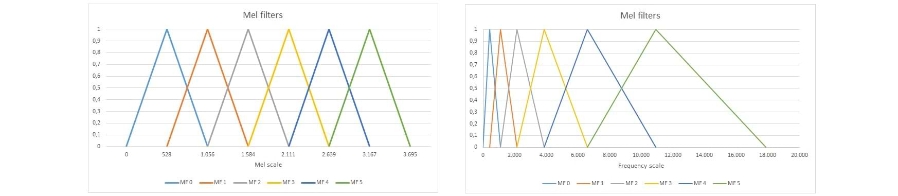
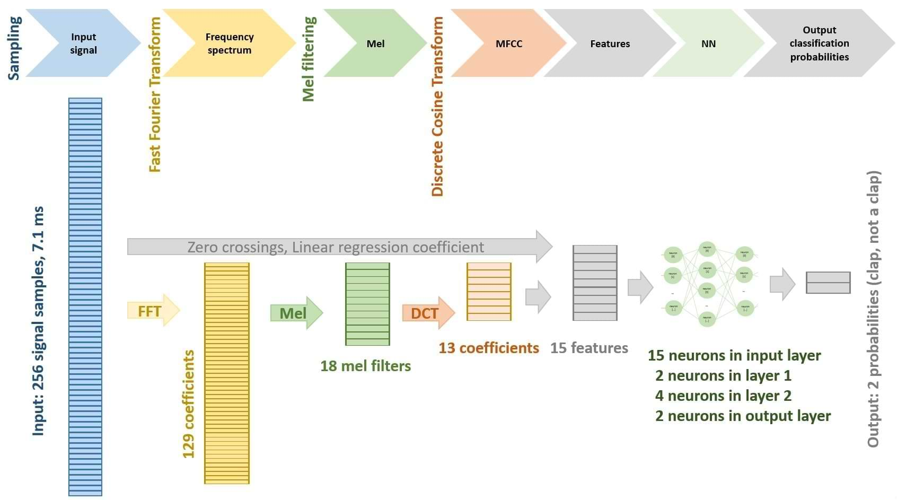

# Neural Network from Scratch (C++ for Arduino) - A Clap Recognition System


Ever dreamed of building a clap recognition system that stays focused even when a dog barks or dishes clatter in the background? Lightweight neural network delivers more than 90% accurate clap detection, all while running efficiently on Arduino boards without straining their resources.


## What You Need

The system is built of the following components:

 - Hardware: an Arduino board (including AVR boards like Mega 2560) with an analog microphone and LED.

 - Sound sampling of audio input.

 - Neural network that recognizes claps from other loud sounds.

 - Training sound patterns collected using the same system to improve model accuracy.

 - LightweightSTL library to assure compatibility of Arduino code with standard C++: https://github.com/BojanJurca/Lightweight-Standard-Template-Library-STL-for-Arduino


## Hardware

Clap recognition, including its neural network is not very demanding. An Arduino Mega 2560 will be just fine or an ESP32 for example. Analog microphones are chip but those that accuratelly output analog sound signal are not so easy to find. A LED diode is connected to board's pin through 220 ohm resistor.


## Sound Sampling

Clap recordings will lasts 7.1 ms. In this time we'll capture 256 samples giving a sampling rate of 35.750 kHz which is adequate for reliable clap detection and feature extraction.


## Neural Network


### Introduction


A neural network consists of layers of interconnected neurons. Each neuron performs a simple computation, but when many layers are combined, the network can approximate very complex functions. The essential components are:

 - Input layer - receives the input data.

 - Hidden layers - transform the data using weights, biases, and activation functions.

 - Output layer - produces the final prediction.

Each layer _L_ computes its output from its input using the following relationship:


$$
\\ \mathrm{neuron}^{L} = af ( {weight}^{L} \times {input}^{L} + {bias}^{L} )
$$


The dimensions of the weight matrix, bias vector, and inputs depend on the specific layer.


The output layer neuron values can be expressed as:


$$
\\ \mathrm{neuron}^{Loutput} = af ( {weight}^{Loutput} \times {   af ( {weight}^{Loutput-1} \times {...   input^{Linput}   ...} + {bias}^{Loutput-1} )   }^{Loutput} + {bias}^{Loutput} )
$$


The output of the neural network is an array containing probabilities of categories that the input pattern can belong to. The equation above does not produce the exact probabilities so the neuron values at the output layer need to be further normalized with softmax function for example:


$$
\\ softmax_{[n]} = \frac{e^{neuron_{[n]}}}{\sum_{i=0}^{N^{Loutput}-1} e^{neuron_{[i]}}}  
$$


### Activation Functions


Activation functions introduce nonlinearity. Without them, no matter how many layers the network has, it would behave like a single linear transformation.

The project uses these activation functions:

 - Sigmoid

 - ReLU

 - Tanh

 - FastTanh (an efficient approximation of Tanh)

Each activation function has different properties, allowing the network to learn various patterns effectively.

The sigmoid function squashes any real input into the open interval (0, 1). It is commonly used in binary classification problems and in some historical neural network architectures. It is smooth and differentiable. Output is bounded between 0 and 1. Derivative becomes extremely small for large |x| (vanishing gradient problem).

The sigmoid function is defined as:


$$
\\ Sigmoid (x) = \frac{1}{1 + e^{-x}}
$$


Rectified Linear Unit (ReLU)

ReLU is widely used in modern neural networks due to its computational simplicity and robustness during training. It is efficient to compute. It avoids vanishing gradients for x > 0 but can cause dead neurons when inputs remain negative.

The ReLU function is defined as:


$$
\\ ReLU (x) = max (0, x)
$$


Hyperbolic Tangent (Tanh)

Tanh is similar to sigmoid but centered around zero, which often improves convergence. Output is in range: (-1, 1). It is zero-centered which is generally better for optimization. As the sigmoid it suffers from vanishing gradients for large |x|.

Tanh can be calculated as:


$$
\\ Tanh (x) = \frac{e^{x} - e^{-x}}{e^{x} + e^{-x}}
$$


FastTanh - Efficient Approximation

FastTanh is a rational approximation of tanh designed for faster computation (with fewer floating-point operations), especially on embedded systems:


$$
\\ FastTanh (x) =
\begin{cases}
-1, & x < -3, \\
\dfrac{x\cdot(27 + x^{2})}{27 + 9x^{2}}, & -3 \le x \le 3, \\
1, & x > 3.
\end{cases}
$$


## The use of LightweightNeuralNetwork.hpp library


To perform a forward pass, you configure the neural network and then provide an input pattern:


```C++
#include "LightweightNeuralnetwork.hpp"


                //   .--- the number of inputs
                //   |    .--- the first layer activation function (Sigmoid, ReLU, Tanh, FastTanh)
                //   |    |    .--- the number of neurons the first layer 
                //   |    |    |                               .--- output layer activation function (Sigmoid, ReLU, Tanh, FastTanh)
                //   |    |    |                               |    .--- the number of neurons in the output layer = the number of outputs
                //   |    |    |                               |    |
neuralNetworkLayer_t<8, ReLU, 16, /* add more if needed */ Sigmoid, 2> neuralNetwork;
// at this point neuralNetwork is initialized with random weights and biases and it is ready for training
// - you can either start training it and export the trained model when fiished
// - or you can load already trained model that is cappable of making usable outputs 

void setup () {

    // import trained model from C++ initializer list or float array
    neuralNetwork = {0x1.099fp+0f,0x1.072ed4p+0f,...,-0x1.1519e4p+1f,-0x1.fdc5b8p+0f,-0x1.8f5b94p-1f};

    // categorize the input pattern
    auto probability = softmax (neuralNetwork.forwardPass ( { 18, 20, 7, 2, 1 } )); // forwardPass returns the array which size corresponds to the output layer neurons, softmax transforms the output to probabilities
    cout << "probabilities: ( ";
    for (auto p : probability)
        cout << p << " ";
    cout << ")\n";
```


It is difficult to tell the neural network topology (meaning the number of layers, how many neurons each would have and their activation functions) in advance. Just try different arrangements and see which works best for your case.


## The implementation of neural network with C++ variadic template


```C++
// hidden layers
    template <size_t inputCount, size_t af, size_t neuronCount, size_t... sizes> 
    class neuralNetworkLayer_t<inputCount, af, neuronCount, sizes...> {

            // data structures needed for this layer: weight and bias
            float weight [neuronCount][inputCount];
            float bias [neuronCount];

            // include the next layer instance which will include the next layer itself, ...
            neuralNetworkLayer_t<neuronCount, sizes...> nextLayer;

    public:

            // calculates the neurons of this layer and returns the category that the input belongs to
            array<float, outputCount> forwardPass (const float input [inputCount]) {   
                float neuron [neuronCount];

                // z = weight x input + bias
                // neuron = af (z)
                    float z [neuronCount];
                    for (size_t n = 0; n < neuronCount; n++) {
                        z [n] = bias [n];
                        for (size_t i = 0; i < inputCount; i++)
                            z [n] += weight [n][i] * input [i];
                        neuron [n] = af (z [n]);
                    }

                // return what the next layer thinks about the neurons clculated here
                    return nextLayer.forwardPass (neuron);
            }
    };

// output layer
    template <size_t inputCount, size_t af, size_t neuronCount> 
    class neuralNetworkLayer_t<inputCount, af, neuronCount> {

            // data structures needed for this layer: weight and bias
            float weight [neuronCount][inputCount];
            float bias [neuronCount];

        public:
        
            // calculates the output neurons of the neural network and returns the category that the input belongs to
            array<float, neuronCount> forwardPass (const float input [inputCount]) {   
                array<float, neuronCount> neuron {};

                // z = weight x input + bias
                // neuron = af (z)
                    float z [neuronCount];
                    for (size_t n = 0; n < neuronCount; n++) {
                        z [n] = bias [n];
                        for (size_t i = 0; i < inputCount; i++)
                            z [n] += weight [n][i] * input [i];
                        neuron [n] = af (z [n]);
                    }

                // start returning the result through all the previous layers
                    return neuron;
            }
    };
```


## Training the neural network


The following training code is a little oversimplified but works well for demonstration.


```C++
    // This part, including testing different typologies, can be done more efficiently on a computer and not necessarily on a controller,
    // as the code is portable to standard C++.

    // Gradient descent:
    #define epoch 1000 // choose the right number of training iterations so the model gets trained but not overtrained
    for (int gradientDescenIteration = 0; gradientDescenIteration < epoch; gradientDescenIteration ++) {
        // normally we would need like 1.000 training patterns

        float loss = 0; // loss = Σ error of training patterns

                                                                    //     .--- tell neuralNetwork that the pattern belongs to category 0 (0 is the index of output vector that designates category 0)
                                                                    //     |
        loss += neuralNetwork.backwardPropagation ( { 1, 2, 6, 18, 20 }, { 1, 0, 0 } ); // expected = probability vector telling the neural network that the pattern belongs to category (with index) 0

                                                                    //        .--- tell neuralNetwork that the pattern belongs to category 1 (1 is the index of output vector that designates category 1)
                                                                    //        |    
        loss += neuralNetwork.backwardPropagation ( { 1, 2, 25, 3, 1 },  { 0, 1, 0 } ); // expected = probability vector telling the neural network that the pattern belongs to category (with index) 1

                                                                    //           .--- tell neuralNetwork that the pattern belongs to category 2 (2 is the index of output vector that designates category 2)
                                                                    //           |    
        loss += neuralNetwork.backwardPropagation ( { 19, 10, 3, 2, 1 }, { 0, 0, 1 } ); // expected = probability vector telling the neural network that the pattern belongs to category (with index) 2
    }

    // export trained model as C++ initializer list
    cout << neuralNetwork << endl;
```


Training the neural network involves setting weights and biases using training patterns at the input and expected results at the output. For each given pattern and expected result, an error is assessed at the output layer, and the weights and biases of the output layer are adjusted to minimize the error. Then, the same process is applied to the previous layer, and so on. This is why the process is called backward propagation-it propagates the error at the output layer back to the previous layers.

With repeated training iterations, the error typically decreases. However, more training doesn't always lead to better classification accuracy. A neural network can become overtrained-meaning it learns the training patterns too precisely, resulting in minimal error on known data but poor generalization to new inputs. This is not the desired outcome. The graph illustrates a typical error reduction trend during the training process.


Since the optimization involves a large number of variables, the error function typically exhibits many local minima, and it is impossible to guarantee where the training process will converge. To mitigate this, the entire procedure must be repeated multiple times with different random initializations. In practice, we randomly initialize the weights and biases, perform gradient descent to reach a local minimum, and repeat this process several times. Finally, we select the solution that yields the highest classification accuracy and the lowest loss (loss being a sum of errors of training patterns). 

Training may be too demanding for Arduino boards, but you can do it on a computer, export the trained model there as C++ initializer list and import it to Arduino. The code is portable to standard C++.


### Bacward propagation theory and formulas to update the weights and the biases


Backward propagation is the algorithm that allows a neural network to learn by adjusting its weights and biases in the direction that reduces the error function. It works by propagating the error from the output layer backward through the network.
Initially, all the weights in all layers of the neural network are initialized with random values. 

Normal Xavier initialization (besides normal Xavier initialization there is also a uniform one that is calculates slightly differently) uses a Gaussian probability distribution with a mean of 0 and a standard deviation of $\sqrt{\frac{2}{I^{L} + N^{L}}}$, where _I<sup>L</sup>_ is the size of the input to layer _L_ and _N<sup>L</sup>_ is the number of neurons in the layer _L_ (size of the output of the layer).

He initialization uses a Gaussian probability distribution with a mean of 0 and a standard deviation of $\sqrt{\frac{2}{I^{L}}}$, where _I<sup>L</sup>_ is the size of the input to layer _L_.


$$
\\ Xavier = N \left( 0, \sqrt{\frac{2}{I^{L} + N^{L}}} \right)
$$


$$
\\ He = N \left( 0, \sqrt{\frac{2}{I^{L}}} \right)
$$


When the Sigmoid (or Tanh) activation function is used, input values are squashed into the range between 0 and 1 (or -1 and 1). This nonlinearity can lead to vanishing gradients, making it difficult for backpropagation to effectively update the network's weights. Xavier initialization addresses this issue by keeping the variance of activations and gradients stable across layers, improving signal flow during training.

In contrast, the ReLU activation function zeroes out all negative inputs, effectively “killing” half of the signal. To compensate for this drop in signal strength, He initialization uses a larger variance than Xavier. This helps maintain the flow of information through the network and ensures more stable training with ReLU-activated layers.

C++ has a built-in pseudo-random generator that produces uniformly distributed random values. The Box-Muller transform can efficiently transform them into Gaussian distributed random numbers. It produces two independent random numbers _N<sub>1</sub>_ and _N<sub>2</sub>_ from two independent uniformly distributed random numbers _U<sub>1</sub>_ and _U<sub>2</sub>_ in the interval (0, 1), but we only need one of them.


$$
\\ N_{1} = \sqrt{-ln (U_{1}))} \cdot cos (2 \cdot \pi \cdot U_{2} ))
$$


The another one (not used here) would be $N_{2} = \sqrt{-ln (U_{1}))} \cdot sin (2 \cdot \pi \cdot U_{2} ))$.


```C++
    // Box-Muller Transform to calculate normaly distributed random variable from uniformly distrubuted random function

    // 1. select 2 independent uniformly distributed random values in interval (0, 1)
    #define MAX_LONG 2147483647
    float U1 = ((float) random (MAX_LONG - 1) + 1) / MAX_LONG;
    float U2 = ((float) random (MAX_LONG - 1) + 1) / MAX_LONG;

    // 2. use Box-Muller transform to tranform them to two independed normally distributed random values with mean of 0 and variance of 1
    float N1 = sqrt (-2 * log (U1)) * cos (2 * M_PI * U2); 
    // float N2 = sqrt (-2 * log (U1)) * sin (2 * M_PI * U2); // we don't actually need the second independent random variable here

    // 3. apply the desired mean of 0 and variance of sqrt (2.0 / inputCount) to random variable N1
    float Xavier = 0 + sqrt (2.0 / (inputCount + neuronCount)) * N1; 
    float He = 0 + sqrt (2.0 / inputCount) * N1; 
```


Biases are usually set to 0.


The derivation of the formulas used to update weights and biases is primarily based on [Backpropagation calculus](https://www.3blue1brown.com/lessons/backpropagation-calculus). Here, we will only add the remaining details.


At this point, the results that the neural network produces are, well, pretty random. The neural network must be trained first with a set of patterns belonging to already known categories. The idea of training on each of the known input patterns is to minimize the difference (or the error) between the expected result and the result that the neural network actually produced. To assess the error of a single pattern, we’ll use a variant of the MSE function (mean squared error):


$$
\\ E = \sum_{n=0}^{N^{Loutput}-1} \frac{1}{2} \cdot \left(neuron_{[n]} - expected_{[n]}  \right)^{2}
$$


We could use some other error functions as well but this one differentiates nicely.

What we need to do is calculate the error function gradients $\frac{\partial E}{\partial weight}$ and $\frac{\partial E}{\partial bias}$ and then update the weights and biases in the opposite direction to which the gradient points in all neural network layers.


$$
\\ weight^{L} -= learningRate \cdot \frac{\partial E}{\partial weight^{L}} \ ; \ where \ learningRate \ is \ a \ predefined \ constant, \ say \ 0.01
$$


$$
\\ bias^{L} -= learningRate \cdot \frac{\partial E}{\partial bias^{L}} \ ; \ where \ learningRate \ is \ a \ predefined \ constant, \ say \ 0.01
$$


### Preliminaries


&nbsp;&nbsp;&nbsp;&nbsp;&nbsp;&nbsp; _**L** – we will count the layers of the neural network with L_ <br>
&nbsp;&nbsp;&nbsp;&nbsp;&nbsp;&nbsp; _**Loutput** = 𝑜𝑢𝑡𝑝𝑢𝑡 𝑙𝑎𝑦𝑒𝑟 𝑜𝑓 𝑛𝑒𝑢𝑟𝑎𝑙 𝑛𝑒𝑡𝑤𝑜𝑟𝑘_ <br>
&nbsp;&nbsp;&nbsp;&nbsp;&nbsp;&nbsp; _**n** - we will count the neurons within each layer with n_ <br>
&nbsp;&nbsp;&nbsp;&nbsp;&nbsp;&nbsp; _**N<sup>L</sup>** = the number of neurons at layer L, which is also the number of outputs of layer L_ <br>
&nbsp;&nbsp;&nbsp;&nbsp;&nbsp;&nbsp; _**i** – we will usually count the inputs to each layer with i_ <br>
&nbsp;&nbsp;&nbsp;&nbsp;&nbsp;&nbsp; _**I<sup>L</sup>** = 𝑡ℎ𝑒 𝑛𝑎𝑢𝑚𝑏𝑒𝑟 𝑜𝑓 𝑖𝑛𝑝𝑢𝑡𝑠 𝑡𝑜 𝑡ℎ𝑒 𝑙𝑎𝑦𝑒𝑟 𝐿_ <br>
&nbsp;&nbsp;&nbsp;&nbsp;&nbsp;&nbsp; _**weight<sup>L</sup>** = weight matrix at layer L_ <br>
&nbsp;&nbsp;&nbsp;&nbsp;&nbsp;&nbsp; _**weight <sup>L</sup><sub>[n][i]</sub>** = element [n][i] of weight matrix at layer L_ <br>
&nbsp;&nbsp;&nbsp;&nbsp;&nbsp;&nbsp; _**bias<sup>L</sup>** = bias vector at layer L_ <br>
&nbsp;&nbsp;&nbsp;&nbsp;&nbsp;&nbsp; _**bias<sup>L</sup><sub>[n]</sub>** = element [n] of bias vector at layer L_ <br>
&nbsp;&nbsp;&nbsp;&nbsp;&nbsp;&nbsp; _**z<sup>L</sup>** = intermediate result vector: z<sup>L</sup> = weight<sup>L</sup> x input<sup>L</sup> + bias<sup>L</sup>_ <br>
&nbsp;&nbsp;&nbsp;&nbsp;&nbsp;&nbsp; _**z<sup>L</sup><sub>[n]</sub>** = element [n] of z vector at layer L_ <br>
&nbsp;&nbsp;&nbsp;&nbsp;&nbsp;&nbsp; _**af** = neuron activation function: af (z)_ <br>
&nbsp;&nbsp;&nbsp;&nbsp;&nbsp;&nbsp; _**af<sup>L</sup><sub>[n]</sub>** = element [n] of calculated neuron value (output) vector at layer L: af (z<sup>L</sup><sub>[n]</sub>)_ <br> 
&nbsp;&nbsp;&nbsp;&nbsp;&nbsp;&nbsp; _**af‘** = neuron activation function derivative_ <br>
&nbsp;&nbsp;&nbsp;&nbsp;&nbsp;&nbsp; _**expected** = vector  of expected values at output layer, since there is only one, we do not have to explicitly label it as e<sup>Loutput</sup>_ <br>
&nbsp;&nbsp;&nbsp;&nbsp;&nbsp;&nbsp; _**expected<sub>[n]</sub>** = element [n] of vector of expected values_ <br>
&nbsp;&nbsp;&nbsp;&nbsp;&nbsp;&nbsp; _**E** = error function calculated on the output of neural network for a single pattern on its input_ <br>
&nbsp;&nbsp;&nbsp;&nbsp;&nbsp;&nbsp; _**delta**_ = $\frac{\partial E}{\partial z}$


#### Gradient $\frac{\partial E}{\partial weight}$ in output layer

Since _E_ is a function of _z_: _E = E (z)_ and _z_ is a function of _weight_: _z = z (weight)_ we can use chain rule for derivatives ( $\frac{\partial f(g(x))}{\partial x}= f'(g(x))⋅g'(x)$  ) to express partial direvaives for each _weight<sub>[n][i]</sub>_. And since _E_ is a function of _af_: _E = E (af)_ and _af_ is a function of _z_: _af = af (z)_ we can use the chain rule again:


&nbsp;&nbsp;&nbsp;&nbsp;&nbsp;&nbsp;&nbsp;&nbsp;&nbsp;&nbsp;[![\\ \frac{\color{Red} \partial E}{\color{Blue} \partial weight_{[n][i]}^{Loutput}} = \frac{\color{Red} \partial E}{\color{DarkGreen}\partial z_{[n]}^{Loutput}} \cdot \frac{\color{DarkGreen}\partial z_{[n]}^{Loutput}}{\color{Blue} \partial weight_{[n][i]}^{Loutput}} = \frac{\color{Red} \partial E}{\partial af_{[n]}^{Loutput}} \cdot \frac{\partial af_{[n]}^{Loutput}}{\color{DarkGreen}\partial z_{[n]}^{Loutput}} \cdot \frac{\color{DarkGreen}\partial z_{[n]}^{Loutput}}{\color{Blue} \partial weight_{[n][i]}^{Loutput}}](https://latex.codecogs.com/svg.latex?%5C%5C%20%5Cfrac%7B%5Ccolor%7BRed%7D%20%5Cpartial%20E%7D%7B%5Ccolor%7BBlue%7D%20%5Cpartial%20weight_%7B%5Bn%5D%5Bi%5D%7D%5E%7BLoutput%7D%7D%20%3D%20%5Cfrac%7B%5Ccolor%7BRed%7D%20%5Cpartial%20E%7D%7B%5Ccolor%7BDarkGreen%7D%5Cpartial%20z_%7B%5Bn%5D%7D%5E%7BLoutput%7D%7D%20%5Ccdot%20%5Cfrac%7B%5Ccolor%7BDarkGreen%7D%5Cpartial%20z_%7B%5Bn%5D%7D%5E%7BLoutput%7D%7D%7B%5Ccolor%7BBlue%7D%20%5Cpartial%20weight_%7B%5Bn%5D%5Bi%5D%7D%5E%7BLoutput%7D%7D%20%3D%20%5Cfrac%7B%5Ccolor%7BRed%7D%20%5Cpartial%20E%7D%7B%5Cpartial%20af_%7B%5Bn%5D%7D%5E%7BLoutput%7D%7D%20%5Ccdot%20%5Cfrac%7B%5Cpartial%20af_%7B%5Bn%5D%7D%5E%7BLoutput%7D%7D%7B%5Ccolor%7BDarkGreen%7D%5Cpartial%20z_%7B%5Bn%5D%7D%5E%7BLoutput%7D%7D%20%5Ccdot%20%5Cfrac%7B%5Ccolor%7BDarkGreen%7D%5Cpartial%20z_%7B%5Bn%5D%7D%5E%7BLoutput%7D%7D%7B%5Ccolor%7BBlue%7D%20%5Cpartial%20weight_%7B%5Bn%5D%5Bi%5D%7D%5E%7BLoutput%7D%7D)](#_)


 - Let's solve this expression part by part. In the first part all the derivateives of $\sum_{k=0}^{N^{Loutput}-1} \frac{1}{2} \cdot \left(af_{[k]}^{Loutput} - expected_{[k]} \right)^{2}$ terms are 0 except when _k_ = _n_:


&nbsp;&nbsp;&nbsp;&nbsp;&nbsp;&nbsp;&nbsp;&nbsp;&nbsp;&nbsp;[![\\ \frac{\color{Red} \partial E}{\partial af_{[n]}^{Loutput}} = \frac{\color{Red} \partial  \sum_{k=0}^{N^{Loutput}-1} \frac{1}{2} \cdot \left(af_{[k]}^{Loutput} - expected_{[k]} \right)^{2}}{\partial af_{[n]}^{Loutput}} = \left(af_{[n]}^{Loutput} - expected_{[n]} \right)](https://latex.codecogs.com/svg.latex?%5C%5C%20%5Cfrac%7B%5Ccolor%7BRed%7D%20%5Cpartial%20E%7D%7B%5Cpartial%20af_%7B%5Bn%5D%7D%5E%7BLoutput%7D%7D%20%3D%20%5Cfrac%7B%5Ccolor%7BRed%7D%20%5Cpartial%20%20%5Csum_%7Bk%3D0%7D%5E%7BN%5E%7BLoutput%7D-1%7D%20%5Cfrac%7B1%7D%7B2%7D%20%5Ccdot%20%5Cleft(af_%7B%5Bk%5D%7D%5E%7BLoutput%7D%20-%20expected_%7B%5Bk%5D%7D%20%5Cright)%5E%7B2%7D%7D%7B%5Cpartial%20af_%7B%5Bn%5D%7D%5E%7BLoutput%7D%7D%20%3D%20%5Cleft(af_%7B%5Bn%5D%7D%5E%7BLoutput%7D%20-%20expected_%7B%5Bn%5D%7D%20%5Cright))](#_)


 - The second part is af' by definition.


&nbsp;&nbsp;&nbsp;&nbsp;&nbsp;&nbsp;&nbsp;&nbsp;&nbsp;&nbsp;[![\\ \frac{\partial af_{[n]}^{Loutput}}{\color{DarkGreen}\partial z_{[n]}^{Loutput}} = \frac{\partial af \left( \color{DarkGreen}\partial z_{[n]}^{Loutput} \color{Black} \right)}{\color{DarkGreen}\partial z_{[n]}^{Loutput}} = {af'}\left(z_{[n]}^{Loutput}\right)](https://latex.codecogs.com/svg.latex?%5C%5C%20%5Cfrac%7B%5Cpartial%20af_%7B%5Bn%5D%7D%5E%7BLoutput%7D%7D%7B%5Ccolor%7BDarkGreen%7D%5Cpartial%20z_%7B%5Bn%5D%7D%5E%7BLoutput%7D%7D%20%3D%20%5Cfrac%7B%5Cpartial%20af%20%5Cleft(%20%5Ccolor%7BDarkGreen%7D%5Cpartial%20z_%7B%5Bn%5D%7D%5E%7BLoutput%7D%20%5Ccolor%7BBlack%7D%20%5Cright)%7D%7B%5Ccolor%7BDarkGreen%7D%5Cpartial%20z_%7B%5Bn%5D%7D%5E%7BLoutput%7D%7D%20%3D%20%7Baf'%7D%5Cleft(z_%7B%5Bn%5D%7D%5E%7BLoutput%7D%5Cright))](#_)


- In the third part all the derivateives of $\sum_{k=0}^{I^{Loutput}-1} \left( {weight_{[n][i]}^{Loutput}}  \cdot af_{[k]}^{Loutput-1} \right) + bias_{[n]}^{Loutput}$ terms are 0 except when _k_ = _i_:


&nbsp;&nbsp;&nbsp;&nbsp;&nbsp;&nbsp;&nbsp;&nbsp;&nbsp;&nbsp;[![\\ \frac{\color{DarkGreen}\partial z_{[n]}^{Loutput}}{\color{Blue} \partial weight_{[n][i]}^{Loutput}} = \frac{\color{DarkGreen}\partial \sum_{k=0}^{I^{Loutput}-1} \left( {weight_{[n][i]}^{Loutput}}  \cdot af_{[k]}^{Loutput-1} \right) + bias_{[n]}^{Loutput}} {\color{Blue} \partial weight_{[n][i]}^{Loutput}} = af_{[i]}^{Loutput-1}](https://latex.codecogs.com/svg.latex?%5C%5C%20%5Cfrac%7B%5Ccolor%7BDarkGreen%7D%5Cpartial%20z_%7B%5Bn%5D%7D%5E%7BLoutput%7D%7D%7B%5Ccolor%7BBlue%7D%20%5Cpartial%20weight_%7B%5Bn%5D%5Bi%5D%7D%5E%7BLoutput%7D%7D%20%3D%20%5Cfrac%7B%5Ccolor%7BDarkGreen%7D%5Cpartial%20%5Csum_%7Bk%3D0%7D%5E%7BI%5E%7BLoutput%7D-1%7D%20%5Cleft(%20%7Bweight_%7B%5Bn%5D%5Bi%5D%7D%5E%7BLoutput%7D%7D%20%20%5Ccdot%20af_%7B%5Bk%5D%7D%5E%7BLoutput-1%7D%20%5Cright)%20%2B%20bias_%7B%5Bn%5D%7D%5E%7BLoutput%7D%7D%20%7B%5Ccolor%7BBlue%7D%20%5Cpartial%20weight_%7B%5Bn%5D%5Bi%5D%7D%5E%7BLoutput%7D%7D%20%3D%20af_%7B%5Bi%5D%7D%5E%7BLoutput-1%7D)](#_)


> [!NOTE]
> Let us at this point define _delta_ as $\frac{\partial E}{\partial z}$. _Delta_ has and important role in backward propagation. With its help we, as we will se:<br>
> - update weights<br>
> - update biases<br>
> - propagate error to the previous layers
>


Considering the terms that we have just solved above we get:


&nbsp;&nbsp;&nbsp;&nbsp;&nbsp;&nbsp;&nbsp;&nbsp;&nbsp;&nbsp;[![\\ {delta_{[n]}^{Loutput}} = \frac{\color{Red} \partial E}{\color{DarkGreen} \partial z_{[n]}^{Loutput}} = \frac{\color{Red} \partial E}{\partial af_{[n]}^{Loutput}} \cdot \frac{\partial af_{[n]}^{Loutput}}{\color{DarkGreen} \partial z_{[n]}^{Loutput}} = \left( af_{[n]}^{Loutput} - expected_{[n]} \right) \cdot {af'}_{[n]}^{Loutput}](https://latex.codecogs.com/svg.latex?%5C%5C%20%7Bdelta_%7B%5Bn%5D%7D%5E%7BLoutput%7D%7D%20%3D%20%5Cfrac%7B%5Ccolor%7BRed%7D%20%5Cpartial%20E%7D%7B%5Ccolor%7BDarkGreen%7D%20%5Cpartial%20z_%7B%5Bn%5D%7D%5E%7BLoutput%7D%7D%20%3D%20%5Cfrac%7B%5Ccolor%7BRed%7D%20%5Cpartial%20E%7D%7B%5Cpartial%20af_%7B%5Bn%5D%7D%5E%7BLoutput%7D%7D%20%5Ccdot%20%5Cfrac%7B%5Cpartial%20af_%7B%5Bn%5D%7D%5E%7BLoutput%7D%7D%7B%5Ccolor%7BDarkGreen%7D%20%5Cpartial%20z_%7B%5Bn%5D%7D%5E%7BLoutput%7D%7D%20%3D%20%5Cleft(%20af_%7B%5Bn%5D%7D%5E%7BLoutput%7D%20-%20expected_%7B%5Bn%5D%7D%20%5Cright)%20%5Ccdot%20%7Baf'%7D_%7B%5Bn%5D%7D%5E%7BLoutput%7D)](#_)


And finally:


&nbsp;&nbsp;&nbsp;&nbsp;&nbsp;&nbsp;&nbsp;&nbsp;&nbsp;&nbsp;[![\\ \frac{\color{Red} \partial E}{\color{Blue} \partial weight_{[n][i]}^{Loutput}} =  {delta_{[n]}^{Loutput}} \cdot af_{[i]}^{Loutput-1}](https://latex.codecogs.com/svg.latex?%5C%5C%20%5Cfrac%7B%5Ccolor%7BRed%7D%20%5Cpartial%20E%7D%7B%5Ccolor%7BBlue%7D%20%5Cpartial%20weight_%7B%5Bn%5D%5Bi%5D%7D%5E%7BLoutput%7D%7D%20%3D%20%20%7Bdelta_%7B%5Bn%5D%7D%5E%7BLoutput%7D%7D%20%5Ccdot%20af_%7B%5Bi%5D%7D%5E%7BLoutput-1%7D)](#_)


#### Gradient $\frac{\partial E}{\partial bias}$ in output layer

Similary we can calculate $\frac{\partial E}{\partial bias^{Loutput}}$. _E_ is a function of _z_: _E = E (z)_ and _z_ is a function of _bias_ so we use the chain rule again:


&nbsp;&nbsp;&nbsp;&nbsp;&nbsp;&nbsp;&nbsp;&nbsp;&nbsp;&nbsp;[![\\ \frac{\color{Red} \partial E}{\color{Purple} \partial bias_{[n]}^{Loutput}} = \frac{\color{Red} \partial E}{\color{DarkGreen}\partial z_{[n]}^{Loutput}} \cdot \frac{\color{DarkGreen}\partial z_{[n]}^{Loutput}}{\color{Purple} \partial bias_{[n]}^{Loutput}} = delta_{n}^{Loutput} \cdot \frac{\color{DarkGreen}\partial \sum_{k=0}^{I^{Loutput}-1} \left( {weight_{[n][k]}^{Loutput}}  \cdot af_{[k]}^{Loutput-1} \right) +  bias_{[n]}^{Loutput}}{\color{Purple} \partial bias_{[n]}^{Loutput}} = delta_{n}^{Loutput} \cdot 1](https://latex.codecogs.com/svg.latex?%5C%5C%20%5Cfrac%7B%5Ccolor%7BRed%7D%20%5Cpartial%20E%7D%7B%5Ccolor%7BPurple%7D%20%5Cpartial%20bias_%7B%5Bn%5D%7D%5E%7BLoutput%7D%7D%20%3D%20%5Cfrac%7B%5Ccolor%7BRed%7D%20%5Cpartial%20E%7D%7B%5Ccolor%7BDarkGreen%7D%5Cpartial%20z_%7B%5Bn%5D%7D%5E%7BLoutput%7D%7D%20%5Ccdot%20%5Cfrac%7B%5Ccolor%7BDarkGreen%7D%5Cpartial%20z_%7B%5Bn%5D%7D%5E%7BLoutput%7D%7D%7B%5Ccolor%7BPurple%7D%20%5Cpartial%20bias_%7B%5Bn%5D%7D%5E%7BLoutput%7D%7D%20%3D%20delta_%7Bn%7D%5E%7BLoutput%7D%20%5Ccdot%20%5Cfrac%7B%5Ccolor%7BDarkGreen%7D%5Cpartial%20%5Csum_%7Bk%3D0%7D%5E%7BI%5E%7BLoutput%7D-1%7D%20%5Cleft(%20%7Bweight_%7B%5Bn%5D%5Bk%5D%7D%5E%7BLoutput%7D%7D%20%20%5Ccdot%20af_%7B%5Bk%5D%7D%5E%7BLoutput-1%7D%20%5Cright)%20%2B%20%20bias_%7B%5Bn%5D%7D%5E%7BLoutput%7D%7D%7B%5Ccolor%7BPurple%7D%20%5Cpartial%20bias_%7B%5Bn%5D%7D%5E%7BLoutput%7D%7D%20%3D%20delta_%7Bn%7D%5E%7BLoutput%7D%20%5Ccdot%201)](#_)


> [!IMPORTANT]
> #### Weight and bias update formulas for output layer
>
> Considering that the neurons at the output layer are already calculated when the error occurs we can calculate _**delta<sup>Loutput<sup>**_:
>
>
> $$
> \\ {delta_{[n]}^{Loutput}} = \left( neuron_{[n]}^{Loutput} - expected_{[n]} \right) \cdot {af'} \left( neuron_{[n]}^{Loutput} \right) \ ; \ n \ ∈\ [0, N^{Loutput}) 
> $$
>
>
> Considering that $\frac{\partial E}{\partial weight_{[n][i]}^{Loutput}} = delta_{[n]}^{Loutput}⋅af_{[i]}^{Loutput-1}$ and $af_{[i]}^{Loutput-1}=input_{[i]}^{Loutput}$ we can update _**weight<sup>Loutput</sup>**_:
> 
>
> $$
> \\ weight_{[n][i]}^{Loutput} -= learningRate \cdot {delta_{[n]}^{Loutput}} \cdot input_{[i]}^{Loutput} \ ; \ learningRate \ is \ tipically \ 0.01 \ ; \ n \ ∈\ [0, N^{Loutput}) \ ; \ i \ ∈ \ [0, I^{Loutput})
> $$
>
>
> Similary we can update _**bias<sup>Loutput</sup>**_:
>
>
> $$
> \\ bias_{[n]}^{Loutput} -= learningRate \cdot {delta_{[n]}^{Loutput}} \ ; \ learningRate \ is \ tipically \ 0.01 \ ; \ n \ ∈\ [0, N^{Loutput})
> $$
>


#### Gradient $\frac{\partial E}{\partial weight}$ in hidden layers


Similarly as we did with the output layer we can go one layer back:

&nbsp;&nbsp;&nbsp;&nbsp;&nbsp;&nbsp;&nbsp;&nbsp;&nbsp;&nbsp;[![\\ \frac{\color{Red} \partial E}{\color{Blue} \partial weight_{[i][j]}^{Loutput-1}} = \frac{\color{Red} \partial E}{\color{DarkGreen}\partial z_{[i]}^{Loutput-1}} \cdot \frac{\color{DarkGreen}\partial z_{[i]}^{Loutput-1}}{\color{Blue} \partial weight_{[i][j]}^{Loutput-1}} = delta_{[i]}^{Loutput-1} \cdot \frac{\color{DarkGreen}\partial z_{[i]}^{Loutput-1}}{\color{Blue} \partial weight_{[i][j]}^{Loutput-1}} = \frac{\color{Red} \partial E}{\partial af_{[i]}^{Loutput-1}} \cdot \frac{\partial af_{[i]}^{Loutput-1}}{\color{DarkGreen}\partial z_{[i]}^{Loutput-1}} \cdot \frac{\color{DarkGreen}\partial z_{[i]}^{Loutput-1}}{\color{Blue} \partial weight_{[i][j]}^{Loutput-1}}](https://latex.codecogs.com/svg.latex?%5C%5C%20%5Cfrac%7B%5Ccolor%7BRed%7D%20%5Cpartial%20E%7D%7B%5Ccolor%7BBlue%7D%20%5Cpartial%20weight_%7B%5Bi%5D%5Bj%5D%7D%5E%7BLoutput-1%7D%7D%20%3D%20%5Cfrac%7B%5Ccolor%7BRed%7D%20%5Cpartial%20E%7D%7B%5Ccolor%7BDarkGreen%7D%5Cpartial%20z_%7B%5Bi%5D%7D%5E%7BLoutput-1%7D%7D%20%5Ccdot%20%5Cfrac%7B%5Ccolor%7BDarkGreen%7D%5Cpartial%20z_%7B%5Bi%5D%7D%5E%7BLoutput-1%7D%7D%7B%5Ccolor%7BBlue%7D%20%5Cpartial%20weight_%7B%5Bi%5D%5Bj%5D%7D%5E%7BLoutput-1%7D%7D%20%3D%20delta_%7B%5Bi%5D%7D%5E%7BLoutput-1%7D%20%5Ccdot%20%5Cfrac%7B%5Ccolor%7BDarkGreen%7D%5Cpartial%20z_%7B%5Bi%5D%7D%5E%7BLoutput-1%7D%7D%7B%5Ccolor%7BBlue%7D%20%5Cpartial%20weight_%7B%5Bi%5D%5Bj%5D%7D%5E%7BLoutput-1%7D%7D%20%3D%20%5Cfrac%7B%5Ccolor%7BRed%7D%20%5Cpartial%20E%7D%7B%5Cpartial%20af_%7B%5Bi%5D%7D%5E%7BLoutput-1%7D%7D%20%5Ccdot%20%5Cfrac%7B%5Cpartial%20af_%7B%5Bi%5D%7D%5E%7BLoutput-1%7D%7D%7B%5Ccolor%7BDarkGreen%7D%5Cpartial%20z_%7B%5Bi%5D%7D%5E%7BLoutput-1%7D%7D%20%5Ccdot%20%5Cfrac%7B%5Ccolor%7BDarkGreen%7D%5Cpartial%20z_%7B%5Bi%5D%7D%5E%7BLoutput-1%7D%7D%7B%5Ccolor%7BBlue%7D%20%5Cpartial%20weight_%7B%5Bi%5D%5Bj%5D%7D%5E%7BLoutput-1%7D%7D)](#_)


While we can use the same deduction as we did for outptul layer for the second part, which is _af'<sub>[i]</sub><sup>Loutput-1</sup>_ and the third part, which is _af<sub>[j]</sub><sup>Loutput-2</sup>_ we can not do the same for the first part  $\frac{\partial E}{\partial af_{[i]}^{Loutput-1}}$. Because this previous-layer neuron _[i]_ influences the error along multiple different paths, the derivative of the error with respect to this neuron, the sensitivity of _E_ to changes in _af<sub>[i]</sub><sup>Loutput-1</sup>_, involves adding up multiple different chain rule expressions corresponding to each path of influence (chain rule for multivariable functions: $\frac{\partial f \left( g \left( x \right) , h \left( x \right) \right)}{\partial x} = \frac{\partial f}{\partial g \left( x \right)} \cdot \frac{\partial g \left( x \right)}{\partial x} + \frac{\partial f}{\partial h \left( x \right)} \cdot \frac{\partial h \left( x \right)}{\partial x}$ ). 


&nbsp;&nbsp;&nbsp;&nbsp;&nbsp;&nbsp;&nbsp;&nbsp;&nbsp;&nbsp;[![\\ \frac{\color{Red} \partial E}{\partial af_{[i]}^{Loutput-1}} = \sum_{n=0}^{N^{Loutput}-1} \frac{\color{Red} \partial E}{\partial af_{[n]}^{Loutput}} \cdot \frac{\partial af_{[n]}^{Loutput}}{\color{DarkGreen} \partial z_{[n]}^{Loutput}} \cdot \frac{\color{DarkGreen} \partial z_{[n]}^{Loutput}}{\partial af_{[i]}^{Loutput-1}}](https://latex.codecogs.com/svg.latex?%5C%5C%20%5Cfrac%7B%5Ccolor%7BRed%7D%20%5Cpartial%20E%7D%7B%5Cpartial%20af_%7B%5Bi%5D%7D%5E%7BLoutput-1%7D%7D%20%3D%20%5Csum_%7Bn%3D0%7D%5E%7BN%5E%7BLoutput%7D-1%7D%20%5Cfrac%7B%5Ccolor%7BRed%7D%20%5Cpartial%20E%7D%7B%5Cpartial%20af_%7B%5Bn%5D%7D%5E%7BLoutput%7D%7D%20%5Ccdot%20%5Cfrac%7B%5Cpartial%20af_%7B%5Bn%5D%7D%5E%7BLoutput%7D%7D%7B%5Ccolor%7BDarkGreen%7D%20%5Cpartial%20z_%7B%5Bn%5D%7D%5E%7BLoutput%7D%7D%20%5Ccdot%20%5Cfrac%7B%5Ccolor%7BDarkGreen%7D%20%5Cpartial%20z_%7B%5Bn%5D%7D%5E%7BLoutput%7D%7D%7B%5Cpartial%20af_%7B%5Bi%5D%7D%5E%7BLoutput-1%7D%7D)](#_)


As we have already derived for output layer, the first two parts under _E_ are _delta<sub>[n]</sub><sup>Loutput</sup>_. The third part is _weight<sub>[n][i]</sub><sup>Loutput</sup>_ since all the derivateives of $\sum_{k=0}^{I^{Loutput}-1} \left( {weight_{[n][i]}^{Loutput}}  \cdot af_{[k]}^{Loutput-1} \right) + bias_{[n]}^{Loutput}$ terms are 0 except when _k_ = _i_:


&nbsp;&nbsp;&nbsp;&nbsp;&nbsp;&nbsp;&nbsp;&nbsp;&nbsp;&nbsp;[![\\ \frac{\color{DarkGreen} \partial z_{[n]}^{Loutput}}{\partial af_{[i]}^{Loutput-1}} = \frac{\color{DarkGreen}\partial \sum_{k=0}^{N^{Loutput}-1} \left( {weight_{[n][k]}^{Loutput}}  \cdot af_{[k]}^{Loutput-1} \right) + bias_{[n]}^{Loutput}}{\partial af_{[i]}^{Loutput-1}} = weight_{[n][i]}^{Loutput}](https://latex.codecogs.com/svg.latex?%5C%5C%20%5Cfrac%7B%5Ccolor%7BDarkGreen%7D%20%5Cpartial%20z_%7B%5Bn%5D%7D%5E%7BLoutput%7D%7D%7B%5Cpartial%20af_%7B%5Bi%5D%7D%5E%7BLoutput-1%7D%7D%20%3D%20%5Cfrac%7B%5Ccolor%7BDarkGreen%7D%5Cpartial%20%5Csum_%7Bk%3D0%7D%5E%7BN%5E%7BLoutput%7D-1%7D%20%5Cleft(%20%7Bweight_%7B%5Bn%5D%5Bk%5D%7D%5E%7BLoutput%7D%7D%20%20%5Ccdot%20af_%7B%5Bk%5D%7D%5E%7BLoutput-1%7D%20%5Cright)%20%2B%20bias_%7B%5Bn%5D%7D%5E%7BLoutput%7D%7D%7B%5Cpartial%20af_%7B%5Bi%5D%7D%5E%7BLoutput-1%7D%7D%20%3D%20weight_%7B%5Bn%5D%5Bi%5D%7D%5E%7BLoutput%7D)](#_)


So finally:

 
&nbsp;&nbsp;&nbsp;&nbsp;&nbsp;&nbsp;&nbsp;&nbsp;&nbsp;&nbsp;[![\\ \frac{\color{Red} \partial E}{\color{Blue} \partial weight_{[i][j]}^{Loutput-1}} = \sum_{n=0}^{N^{Loutput}-1} \left( delta_{[n]}^{Loutput} \cdot weight_{[n][i]}^{Loutput} \right) \cdot  {af'}_{[i]}^{Loutput-1} \cdot af_{[j]}^{Loutput-2} = delta_{[i]}^{Loutput-1}  \cdot af_{[j]}^{Loutput-2}](https://latex.codecogs.com/svg.latex?%5C%5C%20%5Cfrac%7B%5Ccolor%7BRed%7D%20%5Cpartial%20E%7D%7B%5Ccolor%7BBlue%7D%20%5Cpartial%20weight_%7B%5Bi%5D%5Bj%5D%7D%5E%7BLoutput-1%7D%7D%20%3D%20%5Csum_%7Bn%3D0%7D%5E%7BN%5E%7BLoutput%7D-1%7D%20%5Cleft(%20delta_%7B%5Bn%5D%7D%5E%7BLoutput%7D%20%5Ccdot%20weight_%7B%5Bn%5D%5Bi%5D%7D%5E%7BLoutput%7D%20%5Cright)%20%5Ccdot%20%20%7Baf'%7D_%7B%5Bi%5D%7D%5E%7BLoutput-1%7D%20%5Ccdot%20af_%7B%5Bj%5D%7D%5E%7BLoutput-2%7D%20%3D%20delta_%7B%5Bi%5D%7D%5E%7BLoutput-1%7D%20%20%5Ccdot%20af_%7B%5Bj%5D%7D%5E%7BLoutput-2%7D)](#_)


> [!NOTE]
> This equation gives us a usefull connection between _delta<sup>Loutput</sup>_ and _delta<sup>Loutput-1</sup>_. By going to even lower layers it would just mean repeating the same steps again at each layer:
>
>  
> &nbsp;&nbsp;&nbsp;&nbsp;&nbsp;&nbsp;&nbsp;&nbsp;&nbsp;&nbsp;[![\\ delta_{[k]}^{L} =  ... \sum_{i=0}^{N^{Loutput-1}-1} \left( \sum_{n=0}^{N^{Loutput}-1} \left( delta_{[n]}^{Loutput} \cdot weight_{[n][i]}^{Loutput} \right) \cdot  {af'}_{[i]}^{Loutput-1} \cdot weight_{[i][j]}^{Loutput-1} \right) \cdot {af'}_{[j]}^{Loutput-2} ...](https://latex.codecogs.com/svg.latex?%5C%5C%20delta_%7B%5Bk%5D%7D%5E%7BL%7D%20%3D%20%20...%20%5Csum_%7Bi%3D0%7D%5E%7BN%5E%7BLoutput-1%7D-1%7D%20%5Cleft(%20%5Csum_%7Bn%3D0%7D%5E%7BN%5E%7BLoutput%7D-1%7D%20%5Cleft(%20delta_%7B%5Bn%5D%7D%5E%7BLoutput%7D%20%5Ccdot%20weight_%7B%5Bn%5D%5Bi%5D%7D%5E%7BLoutput%7D%20%5Cright)%20%5Ccdot%20%20%7Baf'%7D_%7B%5Bi%5D%7D%5E%7BLoutput-1%7D%20%5Ccdot%20weight_%7B%5Bi%5D%5Bj%5D%7D%5E%7BLoutput-1%7D%20%5Cright)%20%5Ccdot%20%7Baf'%7D_%7B%5Bj%5D%7D%5E%7BLoutput-2%7D%20...)](#_)
>
> 
>  so we can write a recursive equation for all hidden layers:
>
>
> $$
> \\ delta_{[i]}^{L-1} = \sum_{n=0}^{N^{L}-1} \left( delta_{[n]}^{L} \cdot weight_{[n][i]}^{L} \right) \cdot {af'}_{[i]}^{L-1} 
> $$
>


#### Gradient $\frac{\partial E}{\partial bias}$ in previous (hidden) layers


Similary we can calculate $\frac{\partial E}{\partial bias^{L}}$. We use the same logic as for output layer:


&nbsp;&nbsp;&nbsp;&nbsp;&nbsp;&nbsp;&nbsp;&nbsp;&nbsp;&nbsp;[![\\ \frac{\color{Red} \partial E}{\color{Purple} \partial bias_{[i]}^{L}} = \frac{\color{Red} \partial E}{\color{DarkGreen}\partial z_{[i]}^{L}} \cdot \frac{\color{DarkGreen}\partial z_{[i]}^{L}}{\color{Purple} \partial bias_{[i]}^{L}} = delta_{i}^{L} \cdot 1](https://latex.codecogs.com/svg.latex?%5C%5C%20%5Cfrac%7B%5Ccolor%7BRed%7D%20%5Cpartial%20E%7D%7B%5Ccolor%7BPurple%7D%20%5Cpartial%20bias_%7B%5Bi%5D%7D%5E%7BL%7D%7D%20%3D%20%5Cfrac%7B%5Ccolor%7BRed%7D%20%5Cpartial%20E%7D%7B%5Ccolor%7BDarkGreen%7D%5Cpartial%20z_%7B%5Bi%5D%7D%5E%7BL%7D%7D%20%5Ccdot%20%5Cfrac%7B%5Ccolor%7BDarkGreen%7D%5Cpartial%20z_%7B%5Bi%5D%7D%5E%7BL%7D%7D%7B%5Ccolor%7BPurple%7D%20%5Cpartial%20bias_%7B%5Bi%5D%7D%5E%7BL%7D%7D%20%3D%20delta_%7Bi%7D%5E%7BL%7D%20%5Ccdot%201)](#_)


> [!IMPORTANT]
> #### Weight and bias update formulas for previous (hidden) layer
>
>
> Let's shift _L_ by 1 in recursive equation for hidden layers _**delta<sup>L<sup>**_ for practical reasons:
>
>
> $$
> \\ delta_{[i]}^{L} = \sum_{n=0}^{N^{L+1}-1} \left( delta_{[n]}^{L+1} \cdot weight_{[n][i]}^{L+1} \right) \cdot {af'}_{[i]}^{L} \ ; \ i \ ∈ \ [0, N^{L}) 
> $$
>
> Updating _**weight<sup>L</sup>**_ is the same as for output layer:
> 
>
> $$
> \\ weight_{[i][j]}^{L} -= learningRate \cdot {delta_{[i]}^{L}} \cdot input_{[j]}^{L} \ ; \ learningRate \ is \ tipically \ 0.01 \ ; \ i \ ∈\ [0, N^{L}) \ ; \ j \ ∈ \ [0, I^{L})
> $$
>
> 
> Updating _**bias<sup>L</sup>**_ is the same as for output layer:
>
>
> $$
> \\ bias_{[i]}^{L} -= learningRate \cdot {delta_{[i]}^{L}} \ ; \ learningRate \ is \ tipically \ 0.01 \ ; \ i \ ∈\ [0, N^{L})
> $$
>


## Implementation of backward propagation with C++ variadic template


Please note that delta gets updated in two distinct layers: _L_ and _L+1_. Neural network here is implemented as C++ variadic template so one layer can not directly access another's internal data. This is why delta gets updated in two parts. In layer L+1 weight<sup>L+1</sup> x delta<sup>L+1</sup> gets calculated. Once the procssing is returned to layer _L_ it is multiplied by _af'(z<sup>L</sup>_).


```C++
// hidden layers
    template <size_t inputCount, size_t af, size_t neuronCount, size_t... sizes> 
    class neuralNetworkLayer_t<inputCount, af, neuronCount, sizes...> {

        private:

            // data structures needed for this layer: weight and bias
            float weight [neuronCount][inputCount];
            float bias [neuronCount];

            // include the next layer instance which will include the next layer itself, ...
            neuralNetworkLayer_t<neuronCount, sizes...> nextLayer;

        public:

            // iterate from the last layer to the first and update weight and bias meanwhile
            template<typename input_t, typename expected_t>
            float backwardPropagation (const input_t (&input) [inputCount], const expected_t (&expected) [outputCount], float previousLayerDelta [inputCount] = NULL) { // the size of expected in all layers equals the number of neurons of the output layer

                // while moving forward do exactly the same as forwardPass function does
                    float z [neuronCount];
                    float neuron [neuronCount];

                    // z = weight x input + bias
                    // neuron = af (z)
                    for (size_t n = 0; n < neuronCount; n++) {
                        z [n] = bias [n];
                        for (size_t i = 0; i < inputCount; i++)
                            z [n] += weight [n][i] * input [i];
                        neuron [n] = af (z [n]);
                    }

                // calculate the first part of delta in the next layer then apply activation function derivative here
                    // delta = next layer weight * next layer delta * af' (z)
                    float delta [neuronCount];
                    float error = nextLayer.backwardPropagation (neuron, expected, delta);
                    // calculate only the second part of delta, the first par has already been calculated at the next layer
                    for (size_t n = 0; n < neuronCount; n++)
                        delta [n] *= afDerivative (z [n]);

                // update weight and bias at this layer
                    for (size_t n = 0; n < neuronCount; n++) {

                        // update weight
                        for (size_t i = 0; i < inputCount; i++)
                            weight [n][i] -= learningRate * delta [n] * input [i];

                        // update bias
                        bias [n] -= learningRate * delta [n];
                    }

                // calculate only the first part of previous layer delta, since z from previous layer is not available here
                    // previousLayerDelta = weight * delta * af' (previous layer z)
                    for (size_t i = 0; i < inputCount; i++) {
                        previousLayerDelta [i] = 0;
                        for (size_t n = 0; n < neuronCount; n++)
                            previousLayerDelta [i] += weight [n][i] * delta [n];
                    }

                    return error;
            }
    };

// output layer
    template <size_t inputCount, size_t af, size_t neuronCount> 
    class neuralNetworkLayer_t<inputCount, af, neuronCount> {

        private:

            // data structures needed for this layer: weight and bias
            float weight [neuronCount][inputCount];
            float bias [neuronCount];

        public:
        
            // iterate from the last layer to the first and adjust weight and bias meanwhile, returns the error clculated at output layer
            template<typename input_t, typename expected_t>
            float backwardPropagation (const input_t (&input) [inputCount], const expected_t (&expected) [outputCount], float previousLayerDelta [inputCount] = NULL) { // the size of expected in all layers equals the number of neurons of the output layer

                // while moving forward do exactly the same as forwardPass function does
                    float z [neuronCount];
                    float neuron [neuronCount];

                    // z = weight x input + bias
                    // neuron = af (z)
                    for (size_t n = 0; n < neuronCount; n++) {
                        z [n] = bias [n];
                        for (size_t i = 0; i < inputCount; i++)
                            z [n] += weight [n][i] * input [i];
                        neuron [n] = af (z [n]);
                    }

                // calculate the error
                    float error = 0;
                    for (size_t n = 0; n < neuronCount; n++)
                        error += (expected [n] - neuron [n]) * (expected [n] - neuron [n]);
                    error = sqrt (error) / 2;

                // update weight and bias at output layer
                    // delta = (neuron - expected) * af' (z)
                    // weight -= learningRate * delta * input
                    // bias -= learningRate * delta

                    float delta [neuronCount]; 
                    for (size_t n = 0; n < neuronCount; n++) {
                        // calculat delta at output layer    
                        delta [n] = (neuron [n] - expected [n]) * afDerivative (z [n]);

                        // update weight
                        for (size_t i = 0; i < inputCount; i++)
                            weight [n][i] -= learningRate * delta [n] * input [i];

                        // update bias
                        bias [n] -= learningRate * delta [n];
                    }

                // calculate only the first part of previous layer delta, since z from previous layer is not available at this layer
                    // previousLayerDelta = weight * delta * af' (previous layer z)
                    for (size_t i = 0; i < inputCount; i++) {
                        previousLayerDelta [i] = 0;
                        for (size_t n = 0; n < neuronCount; n++)
                            previousLayerDelta [i] += weight [n][i] * delta [n];
                    }

                    return error;
            }
    };
```


## Clap audio recording


Proper preparation of input data is crucial for effective neural network performance. If we had built a convolutional neural network (CNN), we could feed it raw audio recordings directly, allowing the CNN to learn spatial and temporal patterns on its own. However, with a fully connected neural network like ours, a different strategy is required. Instead of raw data, we must extract a set of distinctive features from the sound recording-features that the network can then use for accurate classification.

A clap has a distinctive shape on the oscilloscope, characterized by a loud, rapidly fading high-frequency sound. The most significant condition - a high amplitude of the sound is easily checked before the other features get estimated. These features are extracted or calculated from audio recording and (hopefully) distinguish claps from other loud sounds. Here is an example of a clap audio recording and its features. These features serve as the input to our neural network.


The sound is sampled using 256 samples at a rate of 35.750 kHz, resulting in approximately 7.1 milliseconds of audio. This duration is sufficient to reliably detect a clap.

Some features can be extracted directly from the time-domain signal, as the waveform varies over time.


### Zero Crossings


Zero crossings are calculated by counting how many times the signal crosses the time axis. For a typical clap, around 20 zero crossings can be expected within a 7-millisecond window.


### Linear Regression Coefficient


To estimate how quickly the sound energy decays, we calculate the linear regression coefficient of the signal’s power. Instead of using raw power values, we apply a logarithmic transformation, which better reflects human perception of loudness. This also ensures that louder segments of the recording don’t dominate the analysis, allowing quieter parts to contribute meaningfully.


More distinctive features can be extracted from the frequency domain of the sound signal. Since the focus here is on the mathematical modeling and neural network implementation, we’ll only briefly outline the frequency-based feature extraction process.


### Frequency Spectrum Analysis


To analyze the frequency spectrum of a signal, we apply a Fourier Transform. This mathematical technique decomposes the signal into a sum of sine waves of varying frequencies and amplitudes, revealing which frequencies are present and how strongly they contribute. Since our signal is digitized, we use the discrete form known as the Discrete Fourier Transform (DFT). Efficient algorithms like the Fast Fourier Transform (FFT) compute the DFT in 𝑂(𝑛 log 𝑛) time.


### Human Perception and the Mel Scale


Human perception of sound such as pitch and loudness is inherently nonlinear. We perceive pitch on a logarithmic scale, not a linear one. To better align with this perceptual model, frequency magnitudes are mapped to the mel scale (short for “melody”). This transformation ensures that the frequency representation reflects how we actually hear sound.

Next, mel filters are applied to resample the frequency magnitudes from a linear scale to the mel scale. These magnitudes are then transformed logarithmically to compress the dynamic range and highlight perceptually significant features.

The number of mel filters can vary depending on the application. For example, 20 mel filters are highly effective for recognizing hand claps.


### Mel Filters


Mel filters are triangular filters distributed evenly across the mel scale. Because the mel scale is logarithmic, their spacing on the linear frequency axis is uneven. Each mel filter is defined by three points: a start, a peak, and an end. To construct 20 mel filters, we calculate 22 mel frequency points, which serve as the boundaries and peaks for the filters.





### Mel-Frequency Cepstral Coefficients (MFCC)


The final step in feature extraction for neural networks is computing Mel-Frequency Cepstral Coefficients (MFCCs). While the raw output of mel filters can be fed directly into a neural network, using cepstral coefficients offers several advantages:

 - Reduced correlation between features

 - Lower dimensionality (typically only the first few coefficients are used)

 - Improved noise robustness (higher-order coefficients tend to capture noise)

These benefits often lead to better performance in tasks like speech recognition or audio classification.

MFCCs are computed using the Discrete Cosine Transform (DCT), which converts the logarithmic mel filter outputs into cepstral coefficients. The DCT is similar to the DFT but operates only on real numbers. In essence, we’re analyzing the spectrum of a spectrum and in a playful twist, someone reversed the letters in “spectrum” to coin the term “cepstrum.”

Preparing the features to feed into the neural network may have been a bit confusing so far. Here is an overview that recapitulates everything.



